# prototype chain

### 일반적으로 알고 있는 객체
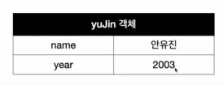

### 사실 __proto__ 라는 프로퍼티가 존재했음
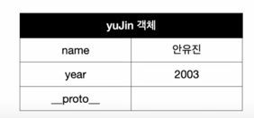

### __proto__는 자신을 생성한 IdolModel이 가지고 있는 prototype이라는 객체를 가리키고 있음
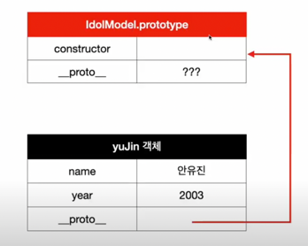

### 근데 prototype이라는 객체는 사실 IdolModel 함수의 prototype임 (JS의 함수는 객체임)
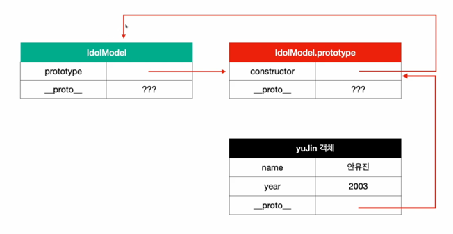

### IdolModel 함수를 new를 불러서 호출하면 yujin 객체가 생성되고 아래의 이미지와 같은 프로토타입 체인이 생성됨
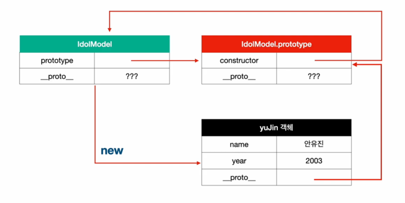

### 전체적인 prototype chain
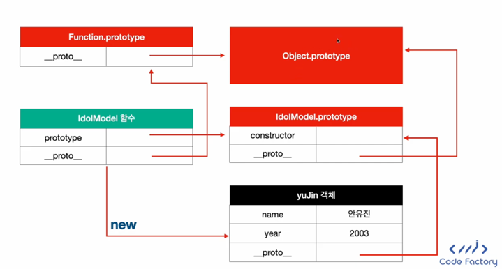

### prototype chain 상속으로 공통 메서드 만들기 전
```javascript
function IdolModel2(name, year) {
    this.name = name;
    this.year = year;

    this.sayHello = function () {
        return `${this.name}이 인사를 합니다.`;
    }
}

const yuJin2 = new IdolModel2('안유진', 2003);
const wonYoung2 = new IdolModel2('장원영', 2002);

console.log(yuJin2.sayHello());
// 안유진이 인사를 합니다.
console.log(wonYoung2.sayHello());
// 장원영이 인사를 합니다.
console.log(yuJin2.sayHello === wonYoung2.sayHello);
// false, 각 객체마다 sayHello() 라는 객체를 가지고 있다.
// 같은 기능인데 따로 메모리를 할당함 -> 비효율적

```
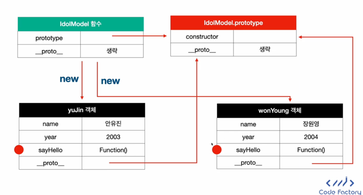

### prototype chain 상속으로 공통 메서드 만든 후

```javascript
function IdolModel3(name, year) {
    this.name = name;
    this.year = year;
}

// IdolModel3.prototype에 정의한다.
// IdolModel3.prototype은 IdolModel3로 생성한 객체들이 모두 참조하는 객체이므로 상속 가능
IdolModel3.prototype.sayHello = function () {
    return `${this.name}이 인사를 합니다.`;
}

const yuJin3 = new IdolModel3('안유진', 2003);
const wonYoung3 = new IdolModel3('장원영', 2004);

console.log(yuJin3.sayHello());
console.log(wonYoung3.sayHello());

console.log(yuJin3.sayHello === wonYoung3.sayHello);
// true

console.log(yuJin3.hasOwnProperty('sayHello'));
// false
```

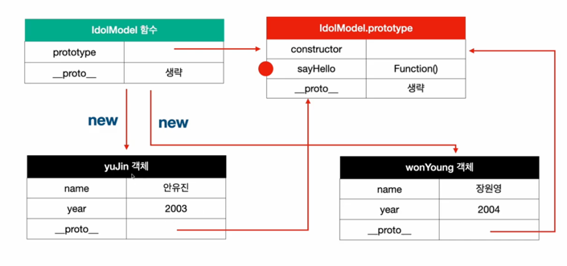

### 프토로타입 변경 (객체 생성 전/후 차이)

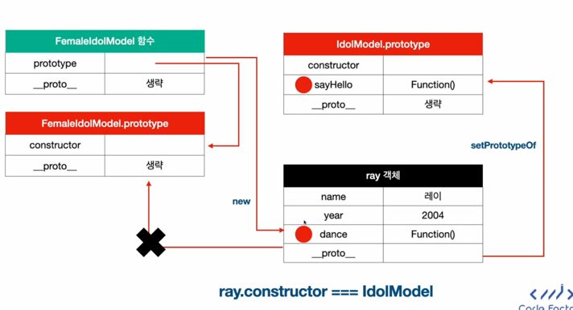

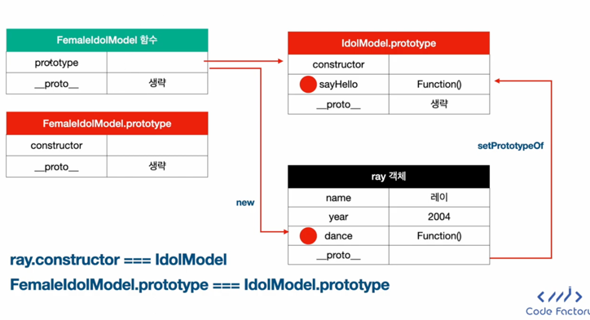

# Execution Context (콜 스택에 쌓이는 단위)

- Execution Context는 실행하려는 JS 코드와 코드를 실행할 때 필요한 정보를 담고 있는 특수한 환경이다. 코드 실행에 필요한 모든 데이터를 들고있는 환경이라고 생각하면 된다.

- Execution Context는 크게 두 개로 나누어진다.
  - Global Context -> 최상위 Execution Context다. 코드를 실행하면 무조건 생성되는 context로 웹에서의 window 객체나 nodeJS에서의 global 객체를 생성하고 들고 있는다.
  - Function Context -> 함수가 실행될 때 마다 함수별로 실행되는 context다. 함수 실행에 대한 모든 정보를 갖고 있는다.

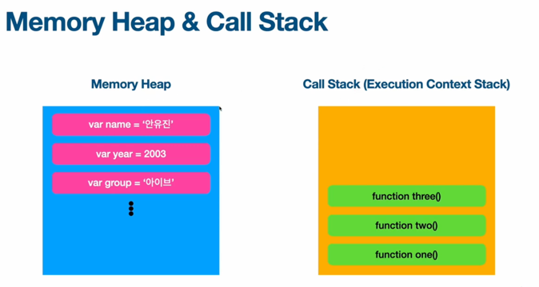

- Creation Phase
  - Global Object 생성 
  - 함수에서는 arguments 객체가 생성
  - this를 global에 바인딩
  - 변수와 함수를 Heap에 배정하고 기본 값을 undefined로 저장한다.(호이스팅 발생하는 이유)
- Execution Phase
  - 코드를 실행한다.
  - 필요하다면 새로운 Execution Context를 생성한다.
