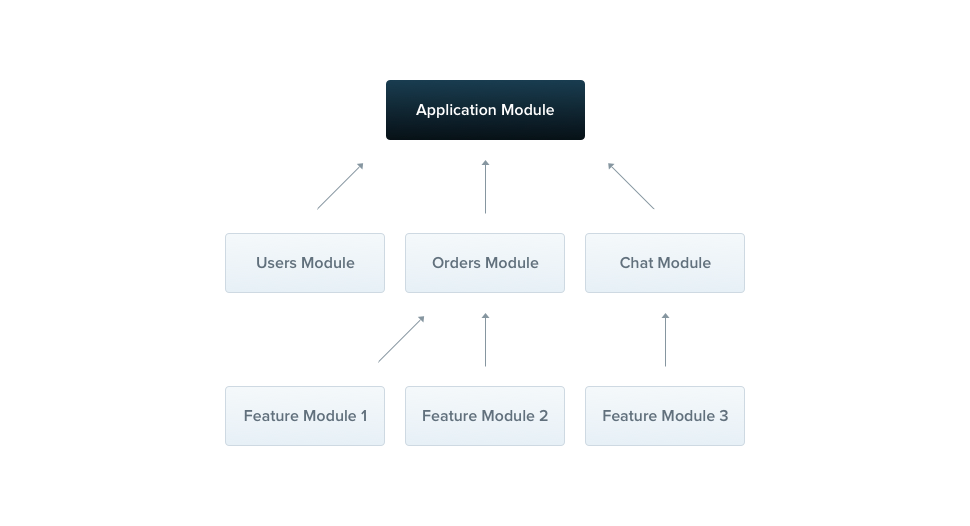
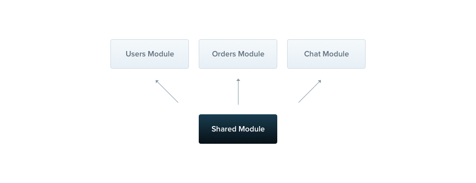

# Modules

모듈은 `@Module()` 데코레이터가 부여된 클래스입니다. `@Module()` 데코레이터는 Nest가 어플리케이션의 구조를 생성하는데 사용하는 메타데이터를 제공합니다.



어플리케이션은 적어도 하나의 루트 모듈을 가지고 있습니다. 루트 모듈은 Nest가 애플리케이션 그래프를 구축하는 데 사용하는 시작점입니다. 

### providers

- 네스트에 의해 인스턴스화 되고 적어도 해당 모듈 내에서는 공유된다.

### controllers

- 해당 모듈에 정의되어 있는 컨트롤러들 

### imports

- 해당 모듈에서 사용할 프로바이더를 exports 하는 또다른 모듈 

### exports

- 이 모듈에서 제공되는 프로바이더의 하위 집합은 이 모듈을 가져오는 다른 모듈에서 사용 가능해야 합니다. 프로바이더 자체를 사용하거나 해당 프로바이더의 토큰(값)을 사용할 수 있습니다.

모듈은 기본적으로 프로바이더를 캡슐화합니다. 이 뜻은 모듈의 프로바이더로 등록되어 있지 않거나 import한 모듈에서 export한 프로바이더가 아니라면 프로바이더를 내 모듈에 주입하는 것이 불가능하다는 것을 의미합니다.


## Shared Modules

Nest에서 모듈은 기본적으로 싱글톤입니다. 따라서 같은 모듈 인스턴스를 서로 다른 모듈 간에 프로바이더들을 손쉽게 공유할 수 있습니다.



모든 모듈은 자동으로 Shared Module이 됩니다. 일단 생성되면 모든 모듈에서 재사용할 수 있습니다.

CatsModule의 CatsService 프로바이더를 제공하고 싶다면 우선 CatsService를 exports 해야합니다.

```typescript
import { Module } from '@nestjs/common';
import { CatsController } from './cats.controller';
import { CatsService } from './cats.service';

@Module({
  controllers: [CatsController],
  providers: [CatsService],
  exports: [CatsService]
})
export class CatsModule {}
```

## Module re-exporting

위에서 볼 수 있듯이 모듈은 내부 프로바이더들을 exports할 수 있습니다. 또한 imports한 모듈을 그대로 exports 할 수도 있습니다.

```typescript
@Module({
  imports: [CommonModule],
  exports: [CommonModule],
})
export class CoreModule {}

```

## Dependency Injection

모듈 클래스 자체에도 프로바이더를 주입할 수 있습니다. (예를 들어 특정 설정을 위해)

그러나 모듈 클래스 자체는 순환 종속성 으로 인해 공급자로 주입될 수 없습니다 .

```typescript
import { Module } from '@nestjs/common';
import { CatsController } from './cats.controller';
import { CatsService } from './cats.service';

@Module({
  controllers: [CatsController],
  providers: [CatsService],
})
export class CatsModule {
  constructor(private catsService: CatsService) {}
}
```

## Global Modules (전역 모듈)

특정 모듈을 모든 곳에서 imports 해야한다면 중복된 코드가 많이 생성될 수 있습니다. 이를 위해 Nest는 `@Global()` 데코레이터를 제공합니다.

전역 모듈은 일반적으로 루트 또는 코어 모듈에 의해 한 번만 등록되어야 합니다. 아래의 예에서 CatsService 프로바이더는 어디에나 존재하며 이 서비스를 주입하려는 모듈은 CatsModule을 imports에 CatsModule을 추가할 필요가 없습니다.

```typescript
import { Module, Global } from '@nestjs/common';
import { CatsController } from './cats.controller';
import { CatsService } from './cats.service';

@Global()
@Module({
  controllers: [CatsController],
  providers: [CatsService],
  exports: [CatsService],
})
export class CatsModule {}
```
> HINT
> 모든 것을 글로벌하게 만다는 것은 좋은 디자인 결정이 아닙니다.

## Dynamic Modules (동적 모듈)

우리는 지금까지 정적 모듈에 대해서만 논의해왔습니다.
동적 모듈을 사용하면 사용자가 입력하는 옵션에 따라서 모듈이 동적으로 변할 수 있습니다.


```typescript
import { Module, DynamicModule } from '@nestjs/common';
import { createDatabaseProviders } from './database.providers';
import { Connection } from './connection.provider';

@Module({
  providers: [Connection],
})
export class DatabaseModule {
  static forRoot(entities = [], options?): DynamicModule {
    const providers = createDatabaseProviders(options, entities);
    return {
      module: DatabaseModule,
      providers: providers,
      exports: providers,
    };
  }
}
```

> HINT
> forRoot() 메서드는 동기적으로 또는 비동기적으로 동적 모듈을 리턴할 수 있습니다. (Promise를 통해)

예시 모듈은 `Connection` 프로바이더를 기본적으로 제공합니다. (`@Module()` 데코레이터 안에서 정의), 하지만 forRoot() 메서드의 매개변수로 전달되는 entities와 options에 따라 providers가 동적으로 변합니다. 

동적 모듈에서 반환된 속성은 @Module() 데코레이터에서 정의된 기본 모듈 메타데이터를 확장(override가 아님)한다는 점에 유의하십시오. 이것이 정적으로 선언된 Connection 프로바이더와 동적으로 생성된 리포지토리 프로바이더가 모듈에서 내보내지는 방식입니다.

만약에 동적 모듈을 전역 모듈로 설정하려면 global 프로퍼티를 true로 설정하세요

```typescript
{
  global: true,
  module: DatabaseModule,
  providers: providers,
  exports: providers,
}
```

DatabaseModule은 다음과 같이 imports 하고 구성할 수 있습니다.

```typescript
import { Module } from '@nestjs/common';
import { DatabaseModule } from './database/database.module';
import { User } from './users/entities/user.entity';

@Module({
  imports: [DatabaseModule.forRoot([User])],
})
export class AppModule {}
```

동적 모듈을 다시 내보내려면 exports 배열에서는 forRoot()메서드 호출을 생략할 수 있습니다.

```typescript
import { Module } from '@nestjs/common';
import { DatabaseModule } from './database/database.module';
import { User } from './users/entities/user.entity';

@Module({
  imports: [DatabaseModule.forRoot([User])],
  exports: [DatabaseModule],
})
export class AppModule {}
```

