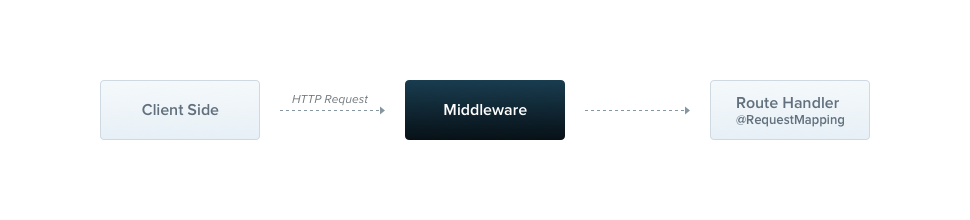

# Middleware

미들웨어는 라우트 핸들러 이전에 호출되는 함수입니다. 미들웨어 함수는 요청 및 응답 객체에 액세스할 수 있으며 애플리케이션의 요청-응답 주기에서 next() 미들웨어 함수도 사용할 수 있습니다. 다음 미들웨어 함수는 일반적으로 next라는 변수로 나타낼 수 있습니다.



네스트의 미들웨어는 기본적으로 express의 미들웨어와 동일합니다. Express의 공식 문서는 미들웨어의 기능을 아래와 같이 설명하고 있습니다.

- 어떤 코드라도 실행 가능.
- 요청 및 응답 객체를 변경 가능.
- 요청-응답 주기를 종료(?).
- 스택에서 다음 미들웨어 함수를 호출.
- 현재 미들웨어 기능이 요청-응답 주기를 종료하지 않으면 next()다음 미들웨어 기능으로 제어를 전달하기 위해 호출해야 합니다. 그렇지 않으면 요청이 중단된 상태로 유지.


네스트 미들웨어를 구현하는 방법은 함수로 할 수도 있고, @Injectable() 데코레이터가 있는 클래스로도 할 수 있습니다. 클래스는 NestMiddleware 인터페이스를 구현해야 하며, 함수는 특별한 요구 사항이 없습니다. 클래스 방법을 사용하여 간단한 미들웨어 기능을 구현해 보겠습니다.

> WARNING
> Express와 fastify는 미들웨어를 다르게 다루고 있고 서로 다른 메서드 시그니처를 제공합니다. [여기](https://docs.nestjs.com/techniques/performance#middleware)서 더 자세한 정보를 읽어보세요.

```typescript
import { Injectable, NestMiddleware } from '@nestjs/common';
import { Request, Response, NextFunction } from 'express';

@Injectable()
export class LoggerMiddleware implements NestMiddleware {
  use(req: Request, res: Response, next: NextFunction) {
    console.log('Request...');
    next();
  }
}

```

## Dependency Injection

네스트 미들웨어는 의존성 주입을 완벽하게 지원합니다. 프로바이더, 컨트롤러와 마차자기로 동일한 모듈 내에서 사용 가능한 의존성을 주입 받을 수 있습니다. (생성자를 통해서...)

## 미들웨어 적용

`@Module()` 데코레이터에는 미들웨어를 위한 공간이 없습니다 (미들웨어 사용을 정의할 공간이 없습니다.) 대신에 우리는 모듈의 클래스와 메서드를 이용하여 미들웨어를 사용할 수 있습니다. 미들웨어를 사용할 모듈 클래스는 NestModule 인터페이스를 구현해야만 합니다.

```typescript
import { Module, NestModule, MiddlewareConsumer } from '@nestjs/common';
import { LoggerMiddleware } from './common/middleware/logger.middleware';
import { CatsModule } from './cats/cats.module';

@Module({
  imports: [CatsModule],
})
export class AppModule implements NestModule {
  configure(consumer: MiddlewareConsumer) {
    consumer
      .apply(LoggerMiddleware)
      .forRoutes('cats');
  }
}
```

위의 예에서 LoggerMiddleware는 `/cats` 경로에 적용됩니다. 또한 특정 HTTP 메서드에만 제한해서 미들웨어를 적용할 수도 있습니다.

```typescript
import { Module, NestModule, RequestMethod, MiddlewareConsumer } from '@nestjs/common';
import { LoggerMiddleware } from './common/middleware/logger.middleware';
import { CatsModule } from './cats/cats.module';

@Module({
  imports: [CatsModule],
})
export class AppModule implements NestModule {
  configure(consumer: MiddlewareConsumer) {
    consumer
      .apply(LoggerMiddleware)
      .forRoutes({ path: 'cats', method: RequestMethod.GET });
  }
}
```

> HINT
> configure() 메서드는 async/await를 이용해서 비동기 메서드로 만들수도 있습니다.
 
> WARNING
> 익스프레스 어댑터를 사용할 때 네스트JS 앱은 기본적으로 body-parser 패키지에서 제공하는 `json` 및 `urlencoded`를 등록합니다. 따라서 `MiddlewareConsumer`를 통해 해당 미들웨어를 사용자 정의하려면 `NestFactory.create()`로 애플리케이션을 생성할 때 bodyParser 플래그를 false로 설정하여 전역 미들웨어를 비활성화해야 합니다.

## Route wildcards

경로에 와일드카드도 지원이 됩니다.

```typescript
forRoutes({ path: 'ab*cd', method: RequestMethod.ALL });

```

> WARNING
> fastify는 더 이상 * 와일드카드를 지원하지 않는 `path-to-regexp` 패키지를 사용합니다. 대신에 파라미터들을 사용해야 합니다. (e.g., `(.*)`, `:splat*`)

## Middleware Consumer

미들웨어 컨슈머는 헬퍼 클래스 입니다. 이는 미들웨어를 관리하기 위한 몇 가지 내장된 메서드를 제공합니다. 이 메서드들은 모두 체이닝이 가능합니다. `forRoutes()` 메서드는 단일 문자열, 복수의 문자열 또는 `RouteInfo` 객체, 단일 컨트롤러 클래스, 심지어 복수의 컨트롤러 클래스도 인수로 받을 수 있습니다. 대부분의 경우 컨트롤러의 리스트를 전달해서 주로 사용할 것입니다.

```typescript
import { Module, NestModule, MiddlewareConsumer } from '@nestjs/common';
import { LoggerMiddleware } from './common/middleware/logger.middleware';
import { CatsModule } from './cats/cats.module';
import { CatsController } from './cats/cats.controller';

@Module({
  imports: [CatsModule],
})
export class AppModule implements NestModule {
  configure(consumer: MiddlewareConsumer) {
    consumer
      .apply(LoggerMiddleware)
      .forRoutes(CatsController);
  }
}
```

> HINT
> `apply()` 메서드 또한 하나의 미들웨어 또는 여러 개의 미들웨어를 받을 수 있습니다.

## Excluding routes (특정 라우트 미들웨어 적용 제외)

또한 `exclude()` 체이닝을 통해 해당 경로에는 미들웨어 적용을 제외시킬 수도 있습니다.

이 메서드는 단일 문자열, 복수의 문자열, RouteInfo 객체를 받을 수 있습니다.


```typescript
consumer
  .apply(LoggerMiddleware)
  .exclude(
    { path: 'cats', method: RequestMethod.GET },
    { path: 'cats', method: RequestMethod.POST },
    'cats/(.*)',
  )
  .forRoutes(CatsController);
```

> exclude() 메서드는 `path-to-regexp`에서 지원하는 와일드카드 파라미터를 지원합니다.

## 함수형 미들웨어

우리가 사용한 `LoggerMiddleware` 클래스는 매우 간단합니다.

여기에는 멤버, 추가 메서드 및 의존성이 없습니다.

사실 클래스를 사용할 이유가 하나도 없습니다. 그러므로 우리는 함수를 사용하여 미들웨어를 적용할 수 있습니다.

```typescript
import { Request, Response, NextFunction } from 'express';

export function logger(req: Request, res: Response, next: NextFunction) {
  console.log(`Request...`);
  next();
};
```

```typescript
// app.module.ts

consumer
  .apply(logger)
  .forRoutes(CatsController);
```

## 멀티 미들웨어

```typescript
consumer.apply(cors(), helmet(), logger).forRoutes(CatsController);
```

## 글로벌 미들웨어

등록된 모든 경로에 미들웨어를 한 번에 바인딩하려면 INestApplication이 제공하는 use() 메서드를 사용할 수 있습니다.

```typescript
const app = await NestFactory.create(AppModule);
app.use(logger);
await app.listen(3000);
```

> HINT
> 글로벌 미들웨어는 DI 컨테이너에 접근할 수 없습니다. app.use()를 사용할 때 함수형 미들웨어를 사용할 수 있습니다. 대안으로는 클래스 미들웨어를 사용하고 App 모듈 (또는 다른 모듈) 내에서 forRoutes('*')를 사용하여 전역 미들웨어를 설정할 수 있습니다.
