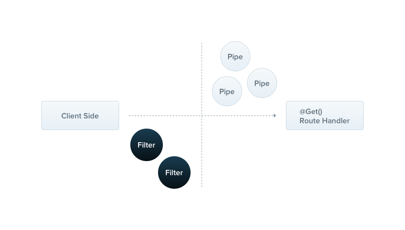
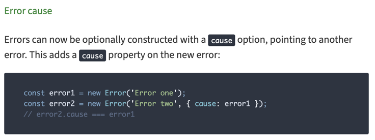

# Exception Filters

네스트는 어플리케이션에서 처리되지 않은 모든 예외들을 처리하는 예외 레이어를 제공합니다.

개발자에 의해 예외가 처리되지 않았을 때, 이 예외는 네스트가 기본 제공하는 에외 레이어에서 처리됩니다.

이 예외 레이어는 적절한 사용자 친화적인 응답을 자동적으로 내려줍니다.



기본적으로 이 작업은 내장된 전역 예외 필터(built-in global exception filter)에서 처리합니다.

이 예외 필터는 HttpException 타입의 예외들을 처리합니다. (물론, HttpException의 서브 타입의 예외들을 포함합니다.)

만약에 내장된 전역 예외 필터에 HttpException 예외가 아니거나 HttpException의 서브 타입 에외들이 아닐 경우에는 기본적으로 아래와 같은 JSON 응답이 내려갑니다.

```json
{
  "statusCode": 500,
  "message": "Internal server error"
}
```

> HINT
> 
> 전역 예외 필터는 부분적으로 http-errors 라이브러리를 지원합니다. 기본적으로 statusCode와 message 프로퍼티를 포함하는 어떠한 예외도 적절하게 내용이 채워지고 응답합니다. (알 수 없는 예외가 발생했을 때 throw 되는 default InternalServerErrorException이 아니라 말이죠)

## 표준 예외 던지기

네스트는 `@nestjs/common`을 통해 내장된 `HttpException`을 제공합니다.

일반적인 HTTP REST/GraphQL API 기반 어플리케이션의 경우 특정 오류 조건에 해당하는 표준 HTTP 응답 객체를 보내는 것이 가장 좋습니다.

예시 설명을 위해 HttpException을 throw 하는 코드를 하드 코딩하겠습니다.

```typescript
@Get()
async findAll() {
  throw new HttpException('Forbidden', HttpStatus.FORBIDDEN);
}
```

> HINT
> 
> 우리는 HttpStatus(@nestjs/common) enum을 사용했습니다. 

위의 예시대로 예외가 던져졌을 때 클라이언트는 아래와 같은 응답을 받게 됩니다.

```json
{
  "statusCode": 403,
  "message": "Forbidden"
}
```

`HttpException`의 생성자는 응답을 결정하는 두 가지 필수적인 파라미터를 받습니다.

- response
  - JSON response body를 정의합니다.
  - string 또는 object가 전달될 수 있습니다.
- status
  - [HTTP 상태 코드](https://developer.mozilla.org/en-US/docs/Web/HTTP/Status)를 정의합니다.

기본적으로 JSON response body는 두 가지 프로퍼티를 포함합니다:

- statusCode
  - 기본적으로 status 프로퍼티에 제공된 상태입니다.
- message
  - HTTP error를 설명할 수 있는 짧은 설명입니다.


JSON 응답 본문의 메시지 부분만 재정의하려면 response인수에 문자열을 제공하세요.

```typescript
throw new HttpException('message', HttpStatus.FORBIDDEN);
```

전체 JSON 응답 본문을 재정의하려면 response인수에 객체를 전달하세요.

```typescript
throw new HttpException(
        {
          status: 400, // JSON 응답을 결정하는 것이지 HTTP Status 자체를 결정하는 것은 아니다.
          error: 'message',
          yourCustomField: 'hello this is test message',
        },
        400, // 실질적인 HTTP 응답 코드를 결정
);
```

```json
{
  "status": 400,
  "error": "message",
  "yourCustomField": "hello this is test message"
}
```
Nest는 객체를 직렬화하여 JSON 응답 본문으로 반환합니다.

두 번째 파라미터인 status는 반드시 유효한 HTTP status code 여야합니다. Best practice는 HttpStatus enum을 사용하는 것입니다.

세 번째 파라미터 options는 optional 입니다. 이 파라미터는 error의 [cause](https://nodejs.org/en/blog/release/v16.9.0/#error-cause)를 제공하기 위해 사용합니다.

cause 객체는 응답 객체로 직렬화 되지 않습니다. 그러나 이 객체는 로그를 남길 목적이나 HttpException을 발생시킨 내부 오류에 대한 귀중한 정보를 제공합니다.



```typescript
@Get()
async findAll() {
  try {
    await this.service.findAll()
  } catch (error) { 
    throw new HttpException({
      status: HttpStatus.FORBIDDEN,
      error: 'This is a custom message',
    }, HttpStatus.FORBIDDEN, {
      cause: error
    });
  }
}
```
결과
```json
{
  "status": 403,
  "error": "This is a custom message"
}
```

## Custom Exceptions

대부분의 경우에는 커스텀 예외를 새로 만들 필요 없이, 기본적으로 정의된 HttpExcpetion들의 서브 타입 예외들을 사용하면 될 것입니다. 만약 커스텀 예외가 필요하다면 HttpException을 상속하는 당신만의 (또는 팀 내에서 정의된) 예외 계층 구조를 사용하는 것이 좋습니다.

HttpException을 상속하는 이 방법을 사용하면 네스트가 자동으로 당신의 예외를 인지하고 처리해줍니다.

```typescript
export class ForbiddenException extends HttpException {
  constructor() {
    super('Forbidden', HttpStatus.FORBIDDEN);
  }
}

@Get()
async findAll() {
  throw new ForbiddenException();
}
```

## Built-in HTTP exceptions

네스트는 HttpException을 상속하는 표준 예외 set를 제공합니다.

- `BadRequestException`
- `UnauthorizedException`
- `NotFoundException`
- `ForbiddenException`
- `NotAcceptableException`
- `RequestTimeoutException`
- `ConflictException`
- `GoneException`
- `HttpVersionNotSupportedException`
- `PayloadTooLargeException`
- `UnsupportedMediaTypeException`
- `UnprocessableEntityException`
- `InternalServerErrorException`
- `NotImplementedException`
- `ImATeapotException`
- `MethodNotAllowedException`
- `BadGatewayException`
- `ServiceUnavailableException`
- `GatewayTimeoutException`
- `PreconditionFailedException`

모든 내장 예외들은 `options` 인자를 이용하여 error cause와 error description을 표현할 수 있도록 제공합니다.

 ```typescript
 throw new BadRequestException('Something bad happened', { cause: new Error(), description: 'Some error description' })
 ```

```json
{
  "message": "Something bad happened",
  "error": "Some error description",
  "statusCode": 400
}
```

## 예외 필터 (Exception filters)

기본적으로 제공되는 전역 예외 필터는 자동적으로 많은 예외들을 처리해줍니다. 하지만 당신은 전역 예외 필터가 아닌 전적으로 커스텀한 조절이 가능한 예외 필터를 원할 수도 있습니다. 예를 들어 당신은 로깅을 추가하거나 다른 형태의 JSON 응답을 내려주고 싶을 수도 있습니다. Exception filter는 이러한 목적을 위해 설계되었습니다. 이를 통해 정확한 제어 흐름과 클라이언트로 전송 되는 응답을 제어할 수 있습니다.

HttpException의 인스턴스인 예외들을 포착(catch)하고 커스텀한 응답 로직을 가지는 커스텀 예외 필터를 만들어보겠습니다. 이를 위해서는 기본(underlying) 플랫폼의 Request & Response 객체에 접근할 필요가 있습니다.origin URL의 정보를 얻어서 로깅을 남기기 위해 Request 객체에 접근할 것 입니다. 또한 JSON 응답 객체를 커스텀하게 바꾸기 위해 Response 객체에 접근할 것입니다. Response 객체를 사용해서 response.json() 메서드를 사용할 것입니다.


 ```typescript
import { ExceptionFilter, Catch, ArgumentsHost, HttpException } from'@nestjs/common';
import { Request, Response } from 'express';

@Catch(HttpException)
export class HttpExceptionFilter implements ExceptionFilter {
  catch(exception: HttpException, host: ArgumentsHost) {
    const ctx = host.switchToHttp();
    const response = ctx.getResponse<Response>();
    const request = ctx.getRequest<Request>();
    const status = exception.getStatus();

    response
      .status(status)
      .json({
        statusCode: status,
        timestamp: new Date().toISOString(),
        path: request.url,
      });
  }
}
```

> HINT
> 
> 모든 예외 필터는 반드시 `ExcpetionFilter<T>` 인터페이스를 구현해야합니다. 이를 위해 `catch(exception: T, host: ArgumentsHost)` 메서드를 구현해야 합니다. 여기서의 제네릭 T는 예외의 타입을 의미합니다.

> WARNING
> 
> 당신이 `@nestjs/platform-fastify` 를 사용한다면 `response.json()` 대신에 `response.send()`를 사용할 수 있습니다. 

`@Catch(HttpException)` 데코레이터는 필수적인 메타데이터를 예외 필터에 바인딩하여 이 필터가 HttpException 예외만을 catch 하고 있으면 네스트에게 알립니다. `@Catch()` 데코레이터는 하나의 파라미터만 받을 수도 있고, 콤마를 이용하여 여러 개의 인자를 전달할 수도 있습니다. 이를 이용하여 하나의 예외 필터에 여러 가지 예외를 잡을 수 있도록 처리할 수 있습니다.


## Arguments host

`catch()` 메서드의 파라미터를 살펴봅시다. `exception` 파라미터는 우리가 처리할 예외 객체 입니다. `host` 파라미터는 ArgumentHost 객체 입니다. ArgumentHost는 강력한 유틸리티 객체입니다. 이 객체는 [execution context](https://docs.nestjs.com/fundamentals/execution-context) 편에서 조금 더 자세히 살펴볼 예정입니다.

이 코드 예제에서 우리는 Request와 Response 객체의 참조를 얻기 위해 ArgumentHost 객체를 사용했습니다. 

이러한 추상화 수준의 이유는 ArgumentsHost는 모든 컨텍스트(예: 현재 작업 중인 HTTP 서버 컨텍스트는 물론 마이크로서비스 및 WebSocket도 포함)에서 작동하기 때문입니다. 실행 컨텍스트 챕터에서는 기능과 헬퍼 함수를 사용하여 실행 컨텍스트 에 대한 적절한 기본 인수에 접근할 수 있는 방법을 살펴보겠습니다. 이를 통해 모든 컨텍스트에서 작동하는 일반 예외 필터를 작성할 수 있습니다

## Binding filters (필터 적용하기)

우리가 만든 HttpExceptionFilter()를 CatsController의 create() 메서드에 적용해보겠습니다.

```typescript
@Post()
@UseFilters(new HttpExceptionFilter())
async create(@Body() createCatDto: CreateCatDto) {
  throw new ForbiddenException();
}
```

`@UseFilters()` 데코레이터를 사용했습니다. 단일 필터 인스턴스를 받을 수도 있고, 콤마를 이용하여 여러 필터 인스턴스를 전달할 수도 있습니다. 예제에서는 인스턴스를 직접 전달했지만 대신에 클래스 자체를 전달할 수도 있습니다. 클래스를 전달할 경우에는 의존성 주입이 네스트의 책임으로 전달됩니다.

```typescript
@Post()
@UseFilters(HttpExceptionFilter)
async create(@Body() createCatDto: CreateCatDto) {
  throw new ForbiddenException();
}
```

> HINT
> 
> 가능하면 인스턴스 대신 클래스를 사용하여 필터를 적용하는 것이 좋습니다. 네스트는 전체 모듈에서 동일한 클래스의 인스턴스를 쉽게 재사용할 수 있으므로 메모리 사용량이 줄어듭니다.

위의 예제에서는 컨트롤러의 단일 메서드에만 적용을 했지만, 예외 필터는 여러 레벨에 거쳐서 적용될 수 있습니다.

- method-scoped
- controller-scoped (controller, resolver, gateway)
- global-scoped


- controller-scoped
```typescript
@UseFilters(new HttpExceptionFilter())
export class CatsController {}
```

- global-scoped
```typescript
async function bootstrap() {
  const app = await NestFactory.create(AppModule);
  app.useGlobalFilters(new HttpExceptionFilter());
  await app.listen(3000);
}
bootstrap();
```

> WARNING
> 
> `useGlobalFilters()` 는 게이트웨이(웹소켓에서 사용) 또는 하이브리드 어플리케이션에 대한 필터를 설정하지 않습니다

글로벌 스코프 필터는 어플리케이션 전반(모든 컨트롤러, 모든 라우팅 핸들러 메서드(API))에 걸쳐서 적용됩니다. 의존성 주입 관점에서 말하면, useGlobalFilters()를 사용하여 모듈 외부에서 등록된 전역 필터는 어떤 모듈의 컨텍스트 외부에서 이루어지기 때문에 종속성을 주입할 수 없습니다. 이 문제를 해결하기 위해 아래의 구조를 사용하여 어떤 모듈에서든 직접 전역 범위의 필터를 등록할 수 있습니다:  

```typescript
import { Module } from '@nestjs/common';
import { APP_FILTER } from '@nestjs/core';

@Module({
  providers: [
    {
      provide: APP_FILTER,
      useClass: HttpExceptionFilter,
    },
  ],
})
export class AppModule {}
```

> HINT
> 
> 이 접근 방식을 사용하여 필터에 대한 의존성 주입을 수행할 경우 이 구성이 사용되는 모듈에 관계 없이 필터는 실제로 전역적이라는 점에 주의하세요. 이를 어디서 해야 할까요? 해당 구조가 정의된 모듈에서 필터(HttpExceptionFilter는 위의 예시에서 언급된 것처럼)를 정의하는 것이 좋습니다. 또한, useClass는 사용자 정의 프로바이더 등록을 다루는 유일한 방법이 아닙니다. [여기](https://docs.nestjs.com/fundamentals/custom-providers)에서 더 알아보세요.

## Catch everything

처리되지 않은 모든 예외를 잡기 위해서는(exception의 타입에 관계없이), @Catch() 데코레이터를 비워두세요. e.g., `@Catch()`

아래의 예의 코드는 플랫폼에 종속적이지 않습니다. 왜냐하면 이 코드는 플랫폼 종속적인 Request, Response를 직접적으로 사용하지 안핬습니다. 대신에 [HTTP adapter](https://docs.nestjs.com/faq/http-adapter)를 사용하여 reponse에 접근했습니다.

```typescript
import {
  ExceptionFilter,
  Catch,
  ArgumentsHost,
  HttpException,
  HttpStatus,
} from '@nestjs/common';
import { HttpAdapterHost } from '@nestjs/core';

@Catch()
export class AllExceptionsFilter implements ExceptionFilter {
  constructor(private readonly httpAdapterHost: HttpAdapterHost) {}

  catch(exception: unknown, host: ArgumentsHost): void {
    // In certain situations `httpAdapter` might not be available in the
    // constructor method, thus we should resolve it here.
    const { httpAdapter } = this.httpAdapterHost;

    const ctx = host.switchToHttp();

    const httpStatus =
      exception instanceof HttpException
        ? exception.getStatus()
        : HttpStatus.INTERNAL_SERVER_ERROR;

    const responseBody = {
      statusCode: httpStatus,
      timestamp: new Date().toISOString(),
      path: httpAdapter.getRequestUrl(ctx.getRequest()),
    };

    httpAdapter.reply(ctx.getResponse(), responseBody, httpStatus);
  }
}
```

> WARNING
> 
> 모든 예외를 포착하는 예외 필터와 특정 예외를 캐치하는 필터를 바인딩할 때 (@UseFilters()를 사용핼 때), 의도한 대로 동작할 수 있도록 모든 예외를 캐치하는 필터를 먼저 선언해야 합니다.


## Inheritance (상속)

일반적으로는, 어플리케이션에 특화된 기능을 수행하는 예외필터를 만들 것입니다. 그러나 내장된 전역 예외 필터를 확장하고 특정 케이스에 대한 동작을 재정의(override)하려는 경우가 있을 수 있습니다.  

이러한 것을 진행하려면 BaseExceptionFilter의 상속된 메서드를 확장하고 호출해야 합니다.

```typescript
import { Catch, ArgumentsHost } from '@nestjs/common';
import { BaseExceptionFilter } from '@nestjs/core';

@Catch()
export class AllExceptionsFilter extends BaseExceptionFilter {
  catch(exception: unknown, host: ArgumentsHost) {
    super.catch(exception, host);
  }
}
```

> WARNING
> 
> BaseExceptionFilter를 확장하면서 Method-scoped, Controller-scoped인 필터는 절대로 `new` 키워드를 이용하여 인스턴스화를 하면 안됩니다. 대신에 프레임워크에 인스턴스화를 위임하세요. -> @UseFilter(MYCustomFilter) 이렇게 사용하라는 뜻

위의 샘플 코드는 구현 방식을 보여주는 단순한 예일 뿐입니다. 확장된 예외 필터의 구현에는 각자의 필요에 따른 로직들이 포함될 것 입니다.

전역 필터는 두 가지 방법으로 base filter를 확장할 수 있습니다.

1. HttpAdpter의 참조를 전역 필터에 전달하고 그 인스턴스를 다시 적용하는 방법입니다.

```typescript
async function bootstrap() {
  const app = await NestFactory.create(AppModule);

  const { httpAdapter } = app.get(HttpAdapterHost);
  app.useGlobalFilters(new AllExceptionsFilter(httpAdapter));

  await app.listen(3000);
}
bootstrap();
```
2. 모듈 클래스에 `APP_FILTER` 를 이용하는 방법입니다. (위에서 살펴봤던)
3. 
