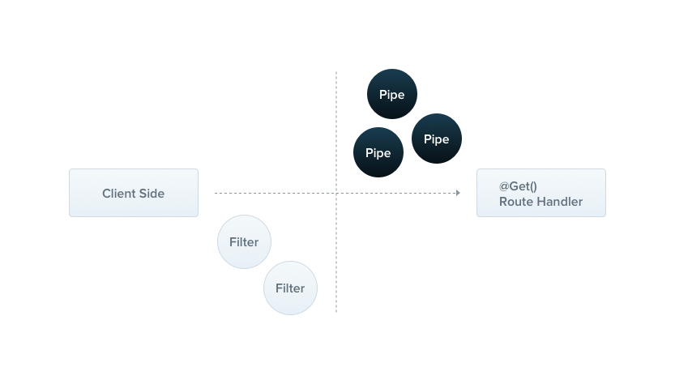

# Pipes

파이프는 PipeTransform 인터페이스를 구현하는 @Injectable() 어노테이션이 붙은 클래스입니다.



파이프는 전형적으로 두 가지 케이스에서 사용합니다.

- transformation (변형) : input 데이터를 변형하기 위해서 (string -> number)
- validation (유효성 검사) : input 데이터를 평가하고 이것이 유효하다면 패스하고 그렇지 않다면 예의를 던지기

두 경우 모두, 파이프는 컨트롤러 라우트 핸들러에서 처리되는 인수에 작용합니다. 네스트는 파이프를 컨트롤러의 라우트 핸들러 실행 전에 위치시킵니다. 파이프는 컨트롤러 메서드에 전달되는 인수들을 전달 받습니다. 모든 변환과 유효성 검사는 이 때 발생하며, 라우트 핸들러는 번형된 인자들과 함께 실행됩니다.

네스트는 바로 사용할 수 있는 내장 파이프들을 제공합니다. 개발자는 커스텀한 파이프를 만들 수도 있습니다. 이 챕터에서 우리는 내장된 파이파들을 살펴보고, 이 파이프를 라우트 핸들러에 어떻게 적용시키는지 알아볼 것입니다. 그 다음에 커스텀한 파이프를 만드는 법을 살펴볼 것입니다.

> HINT
> 
> Pipes run inside the exceptions zone. 이 의미는 파이프가 예외를 던졌을 때 그 예외는 exception layer (전역 필터 또는 해당 메서드에 걸려 있는 필터)에서 처리된다는 뜻입니다. 파이프에서 예외가 발생하면 컨트롤러의 메서드가 실행되지 않는 다는 뜻입니다. 이 시스템은 외부로부터 어플리케이션으로 입력 데이터가 들어올 때 데이터를 검사하는 best-pratice 입니다.

## Built-in pipes

- `ValidationPipe`
- `ParseIntPipe`
- `ParseFloatPipe`
- `ParseBoolPipe`
- `ParseArrayPipe`
- `ParseUUIDPipe`
- `ParseEnumPipe`
- `DefaultValuePipe`
- `ParseFilePipe`

`ParseIntPipe`의 사용법을 간략히 알아보겠습니다. 이 파이프는 핸들러 라우트 메서드의 매개변수가 JavaScript integer 로 변환되는 것을 보장(물론, 변환의 실패 시 예외를 발생시킵니다)하는 사용 사례의 예입니다. 이 장의 뒷 부분에서는 `ParseIntPipe`의 커스텀한 버전도 보게 될 것입니다. 아래의 예제 기술들은 다른 내장 파이프들에도 적용됩니다.  

## Binding pipes

파이프를 사용하기 위해서 우리는 파이프 클래스의 인스턴스를 적절한 컨텍스트에 연결해야합니다. 우리의 ParseIntPipe의 예에서는 우리는 특정 라우트 핸들러 메서드와 연결을 하려고 합니다. 우리는 이것을 라우트 핸들러 메서드의 매개변수에 연결할 수 있습니다.

```typescript
@Get(':id')
async findOne(@Param('id', ParseIntPipe) id: number) {
  return this.catsService.findOne(id);
}
```

이렇게 적용을 했을 시 두 가지 조건 중 하나가 충족됩니다. findOne() 메서드에서 받은 매개 변수가 id가 반드시 number 타입이 됩니다. 그렇지 않다면 라우트 핸들러 메서드가 실행되기 전에 예외가 발생합니다.

아래와 같은 예시 요청을 했다고 가정해봅시다.

```text
GET localhost:3000/abc
```

abc 는 숫자로 변환될 수 없으므로 네스트는 아래와 같은 파이프는 예외를 발생시키고, 예외를 받은 필터는 아래와 같은 응답을 내려줍니다.

````json
{
  "statusCode": 400,
  "message": "Validation failed (numeric string is expected)",
  "error": "Bad Request"
}
````

이 예외는 findOne() 메서드의 본문이 잘못된 매겨변수와 함께 실행되는 것을 예방해줍니다.

위의 예제에서 우리는 인스턴스가 아닌 ParseIntPipe 클래스 자체를 전달했습니다. 하지만 전달 시에 직접 인스턴스화 하여 파이프를 전달할 수도 있습니다. 이 때의 유용함은 인스턴스에 몇 가지 옵션을 추가적으로 전달할 수 있다는 것입니다.

```typescript
@Get(':id')
async findOne(
  @Param('id', new ParseIntPipe({ errorHttpStatusCode: HttpStatus.NOT_ACCEPTABLE }))
  id: number,
) {
  return this.catsService.findOne(id);
}
```

다른 Parse 파이프의 바인딩도 비슷하게 동작합니다. 이러한 파이프는 모두 path parameter, query string, request body value의 유효성을 검사하는 맥락에서 작동합니다.

```typescript
@Get()
async findOne(@Query('id', ParseIntPipe) id: number) {
  return this.catsService.findOne(id);
}

@Get(':uuid')
async findOne(@Param('uuid', new ParseUUIDPipe()) uuid: string) {
  return this.catsService.findOne(uuid);
}
```

`ParseUUIDPipe`는 문자열 매개변수를 구문 분석하고 UUID인지 아닌지 확인하기 위해 사용합니다. 

> HINT
> 
> 버전 3, 4 또는 5에서 UUID를 구문 분석 하는 경우 ParseUUIDPipe()특정 버전의 UUID만 필요한 경우 파이프 옵션에 버전을 전달할 수 있습니다.

위의 예들은 Parse 하는 파이프를 주로 살펴봤습니다. 앞으로는 유효성 검사 (validation)을 위한 파이프들을 주로 살펴 보겠습니다.

> 유효성 검사에 대한 더 많은 자료를 원할 경우에는 [Validation techniques](https://docs.nestjs.com/techniques/validation)을 참조하세요 

## Custom pipes

네스트는 안정적은 ParseIntPipe와 ValidationPipe를 제공하지만, 개발자는 커스텀한 파이프를 만들기를 원할 수도 있습니다.

간단한 ValidationPipe 와 함께 시작해보겠습니다. 처음에는 단순히 입력 값을 받고, 즉시 그 값을 반환하도록 하는 함수를 만들어보겠습니다.

```typescript
import { PipeTransform, Injectable, ArgumentMetadata } from '@nestjs/common';

@Injectable()
export class ValidationPipe implements PipeTransform {
  transform(value: any, metadata: ArgumentMetadata) {
    return value;
  }
}
```

> HINT
> 
> `PipeTransform<T, R>` 는 제네릭 인터페이스입니다. 모든 파이프는 이 인터페이스를 구현해야합니다. 이 인터페이스에서 사용된 T는 입력된 value의 타입을 의미합니다. 그리고 R은 transform 메서드가 리턴하는 타입을 지칭합니다.

모든 파이프는 PipeTransform 인터페이스를 구현해야합니다. 그러므로 transform 추상 메서드를 구현해야합니다. transform 메서드는 두 가지 매개변수를 받습니다.

- value
- metadata

value 파라피터는 라우트 핸들러에 전달될 값입니다. 그리고 metadata는 현재 처리된 메서드 인수의 메타데이터 입니다. metadata 객체는 아래와 같은 프로퍼티들을 가집니다.

```typescript
export interface ArgumentMetadata {
  type: 'body' | 'query' | 'param' | 'custom';
  metatype?: Type<unknown>;
  data?: string;
}
```

이러한 속성은 현재 처리되고 있는 인수를 설명합니다.

- type
  - 인수가 body @Body(), query @Query(), param @Param() 인지 아니면 (커스텀한 파라미터)[https://docs.nestjs.com/custom-decorators]인지 여부를 나타냅니다.
- metatype
  - 인자에 대한 메타타입 정보를 제공합니다. 예를 들어 String 일 수 있습니다. Note: undefined 값이 전달된다면 바닐라 JS를 사용했거나 라우트 핸들러 메서드에서 type 선언을 생략했을 때 입니다.
- data
  - 예를 들어 데코레이터에 전달된 문자열입니다. @Body('string'). 만약에 undefined 라면 데코레이터의 파라미터에 아무것도 전달하지 않은 것입니다.

> WARNING
> 
> 타입스크립트의 인터피에스는 트랜스파일을 거치면 사라집니다. 따라서, 메서드의 파라미터가 인터페이스로 선언되어 있다면 metatype의 값은 Object가 됩니다.

## Schema based validation

우리의 validation 파이프를 조금 더 유용하게 만들어보겠습니다. create() 메서드를 살펴보죠. this.catsService.create() 메서드가 실행되기 전에 createCatDto가 유효한지 확인을 하고 싶을 수 있습니다.

```typescript
@Post()
async create(@Body() createCatDto: CreateCatDto) {
  this.catsService.create(createCatDto);
}
```

```typescript
export class CreateCatDto {
  name: string;
  age: number;
  breed: string;
}
```

우리는 create 메소드로 들어오는 모든 요청에 유효한 본문이 포함되어 있는지 확인하려고 합니다. 따라서 우리는 createCatDto 객체의 세 개의 멤버를 검증해야 합니다. 라우트 핸들러 메서드 내에서 이 작업을 수행할 수 있지만 그렇게 하면 단일 책임 원칙 (SRP) 을 위반하므로 이상적이지 않습니다.

또 다른 접근 방식은 유효성 검사기 클래스를 만들고 그 클래스에 작업을 위임하는 것입니다. 이는 각 메서드 시작 시 유효성 검사기를 호출해야 한다는 단점이 있습니다.

유효성 검사 미들웨어를 적용하는 것은 어떨까요? 이는 작동할 수도 있지만 아쉽게도 전체 어플리케이션의 모든 컨텍스트에서 사용할 수 있는 범용(일반적인) 미들웨어를 만드는 것은 불가능합니다. 이는 미들웨어가 호출될 라우트 핸들러와 해당 매개변수를 포함하여 실행 컨텍스트를 인식하지 못하기 때문입니다.

## Object schema validation (객체 스키마 검증)

깔끔한 방법(DRY 하게)으로 객체 유효성 검사를 하는데는 여러 가지 접근법이 있습니다. 일반적인 접근 방식 중 하나는 스키마 기반 유효성 검사를 실시하는 것입니다.

[Zod](https://zod.dev/) 라이브러리는 읽기 쉬운 API를 제공하고 직관적인 방법으로 스키마를 생성할 수 있게 도와줍니다. 

```shell
$ npm install --save zod
```

아래 코드 샘플에서는 스키마를 생성자 인수로 받는 간단한 클래스를 만듭니다. 그런 다음 우리는 schema.parse() 메서드를 적용하는데, 이는 제공된 스키마에 대해 들어오는 인수를 유효성 검사합니다.

앞서 언급했듯이 유효성 검사 파이프는 변경되지 않은 값을 반환하거나 예외를 발생시킵니다.

다음 섹션에서는 `@UsePipes()` 데코레이터를 사용하여 특정 컨트롤러 메서드에 적절한 스키마를 제공하는 방법을 살펴보겠습니다. 그렇게 하면 우리가 설정한 대로 유효성 검사 파이프를 컨텍스트 전체에서 재사용할 수 있게 됩니다.

```typescript
import { PipeTransform, ArgumentMetadata, BadRequestException } from '@nestjs/common';
import { ZodObject } from 'zod';

export class ZodValidationPipe implements PipeTransform {
  constructor(private schema: ZodObject<any>) {}

  transform(value: unknown, metadata: ArgumentMetadata) {
    try {
      this.schema.parse(value);
    } catch (error) {
      throw new BadRequestException('Validation failed');
    }
    return value;
  }
}
```

## Binding validation pipes (유효성 검사 파이프 적용)

이전에, 우리는 transformation pipes를 어떻게 적용하는지 살펴봤습니다.

유효성 검사 파이프를 적용하는 방법도 매우 직관적입니다.

이 경우에는, 우리는 메서드 호출 레벨에서 파이프를 적용할 수 있습니다. 우리의 현재 예제에서는, 우리는 다음과 같은 단계를 거쳐 ZodValidationPipe를 적용하고 자합니다.

1. ZodValidationPipe 를 인스턴스화 합니다.
2. Zod 스키마를 파이프 클래스의 생성자에 전달합니다.
3. 파이프와 메서드를 연결합니다.

Zod schema example:

```typescript
import { z } from 'zod';

export const createCatSchema = z
  .object({
    name: z.string(),
    age: z.number(),
    breed: z.string(),
  })
  .required();

export type CreateCatDto = z.infer<typeof createCatSchema>;
```

```typescript
@Post()
@UsePipes(new ZodValidationPipe(createCatSchema))
async create(@Body() createCatDto: CreateCatDto) {
  this.catsService.create(createCatDto);
}
```

> WARING
> 
> zod 라이브러리는 tasconfig.json에서 strictNullCheck 설정을 활성화 해야합니다.

## Class validator (Decorator based validation)

> WARNING
> 
> 이 섹션에서의 기술은 TypeScript가 필수적입니다. 당신의 어플리케이션이 바닐라 자바스크립트를 사용하고 있다면 이 기술은 사용할 수 없습니다.

유효성 검사에 또 다른 대안법을 살펴보겠습니다.

네스트는 [class-validator](https://github.com/typestack/class-validator) 라이브러리와도 굉장히 잘 동작합니다. 이 강력한 라이브러리는 데코레이터를 기반으로 하여 유효성 검사를 가능하게 합니다. 데코레이터 기반 유효성 검사는 굉장히 강력합니다. 특히, Nest의 파이프와 함께 사용할 때 말이죠. 그 이유는 처리된 속성의 metatype(ArguementMetadata.metatype) 에 접근할 수 있기 때문입니다.

```shell
$ npm i --save class-validator class-transformer
```

설치가 완료되면, 우리는 CreateCatDto에 몇 개의 데코레이터를 추가할 수 잇습니다. 이렇게 데코레이터를 추가할 때 생기는 이점은 Schema Based validation에서 그러했던 것처럼 유효성 검사를 위한 별도의 소스 (class, object 등등)가 필요 없이 단일 소스인 CreateCatDto에서 정보가 유지된다는 점입니다.

```typescript
import { IsString, IsInt } from 'class-validator';

export class CreateCatDto {
  @IsString()
  name: string;

  @IsInt()
  age: number;

  @IsString()
  breed: string;
}
```

> HINT
> 
> class-validator에 대해서 더 읽어보려면 [여기](https://github.com/typestack/class-validator#usage)를 읽어보세요

```typescript
import { PipeTransform, Injectable, ArgumentMetadata, BadRequestException } from '@nestjs/common';
import { validate } from 'class-validator';
import { plainToInstance } from 'class-transformer';

@Injectable()
export class ValidationPipe implements PipeTransform<any> {
  async transform(value: any, { metatype }: ArgumentMetadata) {
    if (!metatype || !this.toValidate(metatype)) {
      return value;
    }
    const object = plainToInstance(metatype, value);
    const errors = await validate(object);
    if (errors.length > 0) {
      throw new BadRequestException('Validation failed');
    }
    return value;
  }

  private toValidate(metatype: Function): boolean {
    const types: Function[] = [String, Boolean, Number, Array, Object];
    return !types.includes(metatype);
  }
}
```

> HINT
> 
> ValidationPipe참고로 일반 검증 파이프 는 Nest에서 기본적으로 제공되므로 직접 구축할 필요가 없습니다 . 내장형은 ValidationPipe이 장에서 만든 샘플보다 더 많은 옵션을 제공합니다. 이 샘플은 맞춤형 파이프의 메커니즘을 설명하기 위해 기본으로 유지되었습니다. [여기](https://docs.nestjs.com/techniques/validation)에서 많은 예와 함께 자세한 내용을 확인할 수 있습니다 .

> NOTICE
> 
> class-transformer를 사용했습니다. 이 라이브러리는 class-validator의 제작자와 동일하기 때문에 결과적으로 서로 잘 호환되고 동작합니다.

위의 코드를 한 번 살펴보죠. 일단, transfrom() 메서드가 async 처리되어 있습니다. 이는 네스트가 sync 파이파와 async 파이프를 모두 지원하기 때문에 가능합니다. 몇 개의 [class-validator 라이브러리의 유효성 검사 기능이 async 일 수 있기](https://github.com/typestack/class-validator#custom-validation-classes) 때문에 우리는 transform 메서드도 async로 만들었습니다.

그 다음은 구조 분해 할당을 통해 ArgumentMetadata 객체에서 metatype을 가지고 왔습니다.

다음으로, toValidate()라는 도우미 함수에 주목하세요. 이 함수는 현재 처리 중인 인수가 네이티브 JavaScript 타입인 경우 유효성 검사 단계를 우회하는 역할을 합니다 (이러한 타입에는 유효성 검사 데코레이터가 첨부되지 않으므로 유효성 검사 단계를 실행할 이유가 없습니다).

다음으로, 우리는 class-transformer 함수인 plainToInstance()를 사용하여 일반 JavaScript 인수 객체를 형식이 있는 객체로 변환합니다. 이렇게 하는 이유는 네트워크 요청에서 역직렬화된 들어오는 본문 객체가 어떤 유형 정보도 가지고 있지 않기 때문입니다 (이는 Express와 같은 기본 플랫폼이 작동하는 방식입니다). Class-validator는 이전에 DTO에 정의한 유효성 검사 데코레이터를 사용해야 하므로 이 변환을 수행하여 들어오는 본문을 일반적인 바닐라 객체가 아닌 적절히 데코레이트된 객체로 취급해야 합니다.

앞서 언급한 것처럼 이는 유효성 검사 파이프 이므로 변경되지 않은 값을 반환하거나 예외를 발생시킵니다.

마지막으로 ValidationPipe를 연결할 차례입니다. 파이프는 parameter-scoped, method-scoped, controller-scoped, global-scoped에 적용될 수 있습니다. 우리는 파라미터 수준에서 적용을 하도록 하겠습니다.

```typescript
@Post()
async create(
  @Body(new ValidationPipe()) createCatDto: CreateCatDto,
) {
  this.catsService.create(createCatDto);
}
```

## Global scoped pipes (전역 스코프 파이프)

모든 라우트 핸들러에 적용되도록 global scoped pipe를 적용할 수도 있습니다.

```typescript
async function bootstrap() {
  const app = await NestFactory.create(AppModule);
  app.useGlobalPipes(new ValidationPipe());
  await app.listen(3000);
}
bootstrap();
```

> NOTICE
> 
> 하이브리드 앱의 경우 useGlobalPipes() 메서드는 게이트웨이와 마이크로 서비스에 대한 파이프를 설정하지 않습니다. "표준" (하이브리드가 아닌) 마이크로서비스 앱의 경우 useGlobalPipes()는 전역적으로 파이프를 마운트합니다.

전역 파이프는 전체 어플리케이션에, 모든 컨트롤러에 모든 라우트 핸들러 메서드에 적용됩니다.

의존성 주입 측면에서, 모듈 외부에서 등록된 전역 파이프( useGlobalPipes()의 예와 같이)는 바인딩이 모듈의 컨텍스트 외부에서 수행되었기 때문에 의존성을 주입할 수 없습니다. 이 문제를 해결하려면 다음 구성을 사용하여 모든 모듈에서 직접 전역 파이프를 설정할 수 있습니다.

```typescript
import { Module } from '@nestjs/common';
import { APP_PIPE } from '@nestjs/core';

@Module({
  providers: [
    {
      provide: APP_PIPE,
      useClass: ValidationPipe,
    },
  ],
})
export class AppModule {}
```

## built-in ValidationPipe

앞서 말했듯이 일반적은 검증 파이프는 Nest에서 기본적으로 제공되므로 직접 구축할 필요가 없습니다. 

## Transformation use case (변환 파이프 사용 사례)

클라이언트에서 전달된 데이터가 라우트 핸들러 메서드에서 적절하게 처리되기 전에 변경(문자열 -> 정수)을 거쳐야 할 수도 있습니다. 또한 일부 필수 데이터 필드가 누락되었을 수 있으므로 기본값을 적용하고 싶을 수도 있습니다. 변환 파이프는 클라이언트 요청과 라우트 핸들러 사이에서 이러한 기능을 수행할 수 있습니다.

아래의 `ParseIntPipe` 는 string을 정수 값으로 변환하는 역할을 밭고 있습니다.

```typescript
import { PipeTransform, Injectable, ArgumentMetadata, BadRequestException } from '@nestjs/common';

@Injectable()
export class ParseIntPipe implements PipeTransform<string, number> {
  transform(value: string, metadata: ArgumentMetadata): number {
    const val = parseInt(value, 10);
    if (isNaN(val)) {
      throw new BadRequestException('Validation failed');
    }
    return val;
  }
}
```

```typescript
@Get(':id')
async findOne(@Param('id', new ParseIntPipe()) id) {
  return this.catsService.findOne(id);
}
```

또 다른 유용한 변환 사례는 리퀘스트 파라미터로 전달된 유저 id를 가지고 데이터베이스의 사용자 entity를 반환할 수도 있습니다.

```typescript
@Get(':id')
findOne(@Param('id', UserByIdPipe) userEntity: UserEntity) {
  return userEntity;
}
```

이 파이프의 구현은 독자에게 맡겨둡니다. 그러나 모든 다른 변환 파이프와 마찬가지로 이 파이프는 입력값 (id)을 받아 출력값 (UserEntity 객체)을 반환합니다. 이를 통해 핸들러에서 보일러플레이트 코드를 추상화하고 공통 파이프로 이동함으로써 코드를 선언적이고 DRY하게 만들 수 있습니다.

## Providing defaults (기본값 제공)

Parse 파이프는 파라미터의 값이 정의되어 있을 것을 기대합니다. 파라미터가 null이거나 undefined 라면 Parse 파이프들은 parsing할 값이 없으므로 예외를 던져버립니다. 우리는 이러한 예외를 막기 위해 기본값 파이프 (DefaultValuePipe)를 전달할 수도 있습니다. 간단하게 DefaultValuePipe를 인스턴스화 하고 적용하고자 하는 데코레이터에 정의하면 됩니다. 아래의 예에서는 다른 Parse 파이프 이전에 전달한 것을 주의해주세요

```typescript
@Get()
async findAll(
  @Query('activeOnly', new DefaultValuePipe(false), ParseBoolPipe) activeOnly: boolean,
  @Query('page', new DefaultValuePipe(0), ParseIntPipe) page: number,
) {
  return this.catsService.findAll({ activeOnly, page });
}
```
