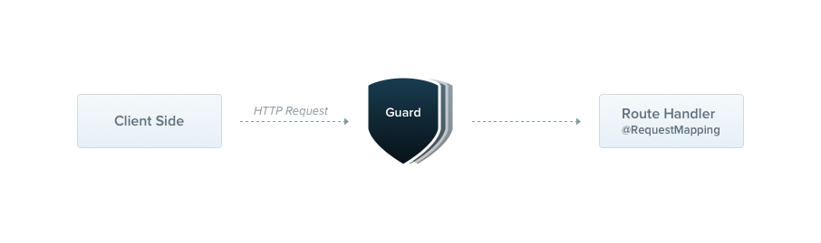

# Guards

가드는 @Injectable() 데코레이터가 붙어 있고, CanActivate 인터페이스를 구현하는 클래스입니다.



가드는 하나의 책임만을 가지고 있습니다. 가드는 런타임에 특정 조건에 따라 라우트 핸들러가 들어온 요청을 처리할 것인지 아닌지를 결정합니다 (permissions, 역할, ACL 등과 같이 말이죠) 이것은 인가라고 불리고는 합니다. 인가 (흔히, 인증과 함께 동작)는 전통적인 익스프레스 어플리케이션에서는 일반적으로 미들웨어에 의해 처리되어 왔습니다. 미들웨어는 인증을 위해서 훌륭한 선택입니다. 왜냐하면 토큰의 유효성 검사와 요청 객체에 프로퍼티를 추가하는 것과 같은 작업은 특정 API 컨텍스트 및 메타데이터와 강력하게 연결되어 있지 않기 때문입니다.

하지만 미들웨어는 태생적으로 멍청합니다. 미들웨어는 next() 함수 실행 후에 어떤 라우트 핸들러가 실행될지 알지 못합니다. 반면에 가드는 ExecutionContext 인스턴스에 접근할 수 있고, 따라서 다음으로 어떠한 것들이 실행될지 알 수 있습니다. 이들은 예외 필터, 파이프 및 인터셉터와 마찬가지로 정확한 시점에서 요청/응답 주기에 처리 로직을 끼워넣고, 이를 선언적으로 수행할 수 있도록 설계되었습니다. 이는 당신의 코드를 DRY하고 선언적이도록 도와줍니다.

> HINT
> 
> 가드는 모든 미들웨어 다음으로 실행됩니다. 그러나 모든 인터셉터나 파이프 이전에 실행됩니다.

## Authorization Guard

앞서 말했듯이, 인가는 가드에 대한 훌륭한 사용 사례입니다. 특정 API는 호출자가 충분한 권한을 가지고 있을 때애만 사용 가능해야 합니다. 우리가 지금 만들 AuthGuard는 인증된 사용자를 가정합니다 (따라서 토큰이 요청 헤더에 첨부되어 있다고 가정합니다). 이 Guard는 토큰을 추출하고 유효성을 검사하며, 추출된 정보를 사용하여 요청이 진행될 수 있는지 여부를 결정합니다.

```typescript
import { Injectable, CanActivate, ExecutionContext } from '@nestjs/common';
import { Observable } from 'rxjs';

@Injectable()
export class AuthGuard implements CanActivate {
  canActivate(
    context: ExecutionContext,
  ): boolean | Promise<boolean> | Observable<boolean> {
    const request = context.switchToHttp().getRequest();
    return validateRequest(request);
  }
}
```

> HINT
> 
> 만약 인증 구현에 대한 현실세계의 예제를 찾고 있다면 [여기](https://docs.nestjs.com/security/authentication)를 방문하세요. 그렇지 않고 보다 정교한 인증 기능 예제를 보려면 [여기](https://docs.nestjs.com/security/authorization)를 방문하세요

 `validateRequest()` 함수 내의 로직은 필요에 따라 간단할 수도 있고, 복잡할 수도 있습니다. 중요한 점은 이 예제가 요청/응답 주기에 어떻게 맞춰지는 지를 확인하는 것입니다.

모든 가드는 canActivate() 메서드를 구현해야 합니다. 이 메서드는 boolean을 리턴합니다. 이 boolean 값은 현재의 요청이 허가되는지 그렇지 않은지를 나타냅니다. 이 가드는 응답을 동기적으로 또는 비동기적으로 반환할 수 있습니다. (Promise or Observable을 통해). Nest는 반환된 값을 사용하여 다음 동작을 제어합니다.

- 만약에 true를 리턴할 경우 요청은 그대로 진행됩니다.
- 만약에 false를 리턴할 경우, 네스트는 요청을 거부합니다.

## Execution context

`canActivate()` 메서드는 ExecutionContext라는 하나의 인수만 받습니다. ExecutionContext는 ArgumentsHost를 상속합니다. 이전에 예외 필터 챕터에서 ArgumentsHost를 살펴보았습니다. 위의 샘플에서는 이전에 사용한 것과 동일한 ArgumentsHost에 정의된 도우미 메서드를 사용하여 Request 객체에 대한 참조를 얻는 것뿐입니다. 더 자세한 내용은 예외 필터 챕터의 Arguments host 섹션을 참조할 수 있습니다.

ExecutionContext가 ArgumentsHost를 확장하면서 현재 실행 프로세스에 대한 디테일한 정보를 제공하는 추가적인 헬퍼 메서드가 추가되었습니다. 이러한 세부 정보는 더 넓은 범위의 컨트롤러, 메서드 및 실행 컨텍스트에서 작동할 수 있는 보다 일반적인 가드를 구축하는 데 도움이 될 수 있습니다. [ExecutionContext](https://docs.nestjs.com/fundamentals/execution-context)에 대해 더 자세히 알아보세요.


## Role-based authentication

특정 역할을 가진 사용자만 접근을 허용하는 더 기능적인 가드를 만들어 봅시다. 먼저 기본 가드 템플릿을 작성하고, 이후 섹션에서 이를 발전시켜 보겠습니다. 현재 이 기본 템플릿은 모든 요청을 허용합니다.

```typescript
import { Injectable, CanActivate, ExecutionContext } from '@nestjs/common';
import { Observable } from 'rxjs';

@Injectable()
export class RolesGuard implements CanActivate {
  canActivate(
    context: ExecutionContext,
  ): boolean | Promise<boolean> | Observable<boolean> {
    return true;
  }
}
```

## Binding guards (가드 연결)

파이프, 예외필터와 마찾가지로 가드도 controller-scoped, method-scoped, global-scoped가 될 수 있습니다. 아래에서 우리는 `@UseGuards()` 데코레이터를 이용하여 컨트롤러 스코프의 가드를 만들 수 있습니다. 이 데코레이터는 하나의 인수를 받을 수 있습니다. 또한 콤마를 기준으로 하여 여러개의 인수를 받을 수도 있습니다. 

```typescript
@Controller('cats')
@UseGuards(RolesGuard)
export class CatsController {}
```

위의 코드에서 우리는 `RolesGuard` 클래스를 넘겼습니다. (인스턴스를 넘기는 대신에 말이죠) 이렇게 할 시 프레임워크가 인스턴스화를 책임지게 됩니다. 그리고 의존성 주입이 가능하게 됩니다. 파이프와 예외필터가 그러했던 것처럼 인스턴스를 넘기는 것도 가능합니다.

```typescript
@Controller('cats')
@UseGuards(new RolesGuard())
export class CatsController {}
```

위의 구성은 모든 컨트롤러에 가드를 연결시킵니다. 단일 메서드에 가드를 연결시키려면 메서드 레벨에 연결하면 됩니다.

글로벌하게 가드를 적용시키기 위해서는 `useGlobalGuards()`를 사용하면 됩니다.

```typescript
const app = await NestFactory.create(AppModule);
app.useGlobalGuards(new RolesGuard());
```

> NOTICE
> 
> 하이브리드 어플리케이션의 경우 `useGlobalGuards()` 로 가드가 설정되지 않습니다. 표쥰 (하이브리드가 아닌) 마이크로서비스 앱만 `useGlobalGuards()` 가드가 글로벌 하게 적용됩니다.

글로벌 가드는 어플리케이션 전체에 모든 컨트롤러에 모든 라우트 핸들러에 적용됩니다. 의존성 주입 측면에서, useGlobalGuards()를 사용하여 모듈 외부에서 등록된 전역 가드는 모듈의 컨텍스트 외부에서 수행되기 때문에 의존성을 주입할 수 없습니다. 이 문제를 해결하기 위해 다음 구조를 사용하여 어떤 모듈에서든 직접 가드를 설정할 수 있습니다:

```typescript
import { Module } from '@nestjs/common';
import { APP_GUARD } from '@nestjs/core';

@Module({
  providers: [
    {
      provide: APP_GUARD,
      useClass: RolesGuard,
    },
  ],
})
export class AppModule {}
```

## Setting roles per handler

`RolesGuard` 는 동작하긴하지만 아직 똑똑하게 동작하지는 않습니다. 우리는 ExecutionContext라는 가드의 가장 중요한 기능을 사용하여 이점을 보고 있지는 않습니다. 이 가드는 각 역할에 대해 또는 각 라우트 핸들러에 어떤 역할이 허용되는지 알지 못합니다. `CatsController` 를 예로 들면, 서로 다른 경로에 서로 다른 접근 권한을 부여할 수 있습니다. 관리자만 접근 가능하게 할 수도 있고, 아니면 모두가 접근 가능할 수도 있습니다. 라우터와 역할을 유연하면서도 재사용가능하게 어떻게 매칭할 수 있을까요?

커스텀 메타데이터가 중요한 지점이 바로 지금입니다 ([여기](https://docs.nestjs.com/fundamentals/execution-context#reflection-and-metadata)에서 더 살펴보세요). Nest는 `Reflector#createDecorator` 정적 메서드를 통해 생성된 데코레이터 또는 내장된 @SetMetadata() 데코레이터를 통해 라우트 핸들러에 사용자 정의 메타데이터를 첨부할 수 있는 기능을 제공합니다.

```typescript
import { Reflector } from '@nestjs/core';

export const Roles = Reflector.createDecorator<string[]>();
```

`Roles` 데코레이터는 문자열 리스트를 인수로 받습니다. 이 데코레이터를 사용하기 위해 우리는 간단하게 핸들러 라우트 함수에 연결만 하면 됩니다.

```typescript
@Post()
@Roles(['admin'])
async create(@Body() createCatDto: CreateCatDto) {
  this.catsService.create(createCatDto);
}
```

우리는 create() 메서드가 'admin' 권한을 가진 사용자만 접근가능함을 나타냅니다.

대안으로 `Reflector#createDecorator` 메서드를 사용하는 대신에 `@SetMetadata()` 데코레이터를 사용할 수도 있습니다. 더 자세한 건 [여기](https://docs.nestjs.com/fundamentals/execution-context#low-level-approach)를 참조하세요

## Putting it all together

이제 다시 우리의 `RolesGuard` 로 돌아가서 작업한 것들을 연결시켜 보겠습니다. 현재, 단순하게 모든 경우에 대해서 true를 리턴하고 있습니다. 이건 모든 요청에 대해 라우트에 대한 접근을 허용하고 있다는 뜻입니다. 우리는 현재 사용자에게 할당된 권한에 따라서 조건적인 값을 리턴하고 싶습니다. 이 작업을 위해서 우리는 다시 Reflector 헬퍼 클래스를 사용할 것입니다.

```typescript
import { Injectable, CanActivate, ExecutionContext } from '@nestjs/common';
import { Reflector } from '@nestjs/core';
import { Roles } from './roles.decorator';

@Injectable()
export class RolesGuard implements CanActivate {
  constructor(private reflector: Reflector) {}

  canActivate(context: ExecutionContext): boolean {
    const roles = this.reflector.get(Roles, context.getHandler());
    if (!roles) {
      return true;
    }
    const request = context.switchToHttp().getRequest();
    const user = request.user;
    return matchRoles(roles, user.roles);
  }
}
```

> HINT
> 
> Node.js 환경에서는 일반적으로 인증된 사용자를 요청 객체에 첨부하는 것이 일반적인 관행입니다. 따라서 위의 샘플 코드에서는 request.user가 사용자 인스턴스와 허용된 역할을 포함하고 있다고 가정하고 있습니다. 여러분의 앱에서는 이러한 연결을 사용자 정의 인증 가드(또는 미들웨어)에서 수행할 것으로 예상됩니다. 이 주제에 대한 자세한 정보는 [해당 챕터](https://docs.nestjs.com/security/authentication)를 확인하세요.

> WARNING
> 
> matchRoles() 함수의 로직은 필요에 따라 간단할 수도 있고 복잡할 수도 있습니다. 주요한 점은 가드가 어떻게 요청/응답 사이클에서 동작하는지 확인하는 것입니다.

Reflector를 컨텍스트에 기민하게 활용하는 방법에 대한 자세한 내용은 "Execution context" 챕터의 "Reflection and metadata" 섹션을 참조하십시오.

권한이 부족한 사용자가 엔드포인트를 요청할 때, Nest는 자동으로 다음과 같은 응답을 반환합니다:

```json
{
  "statusCode": 403,
  "message": "Forbidden resource",
  "error": "Forbidden"
}
```

주의할 점은 가드가 false를 반환할 때 프레임워크가 ForbiddenException을 throw한다는 것입니다. 다른 에러 응답을 반환하려면 자체적인 예외를 throw해야 합니다. 예를 들면:

```typescript
throw new UnauthorizedException();
```

가드에서 throw된 예외는 예외 레이어(전역 예외 필터 및 현재 컨텍스트에 적용된 모든 예외 필터)에서 처리됩니다.

> HINT
> 
> 만약 권한 부여를 구현하는 실제 예제를 찾고 있다면, 이 [챕터](https://docs.nestjs.com/security/authorization)를 확인하세요.

