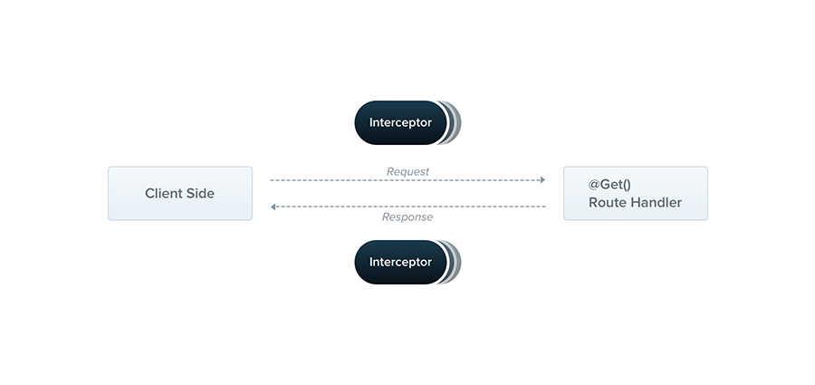

# Interceptors

인터셉터는 `@Injectable()` 데코레이터가 붙어 있고 `NestInterceptor` 인터페이스를 구혛나는 클래스입니다.



인터셉터는 AOP 기술에서 영감을 받은 유용한 기능들을 가지고 있습니다.

- 메서드의 실행 전/후로 추가적인 로직을 연결할 수 있습니다.
- 함수에서 리턴한 결과를 변형할 수 있습니다.
- 함수에서 던져진 예외를 변형합니다.
- 함수의 기본 동작을 확장합니다.
- 특정 조건에 따라 함수를 완전히 재정의(오버라이드) 합니다. (예를 들어, 캐싱 목적)

## Basics

각 인터센터는 `intercept()` 메서드를 구현해야합니다. intercept() 메서드는 두 개의 파라미터를 가지고 있습니다. 첫 번째는 `ExecutionContext` 인스턴스 입니다 (guards에서 사용했던 것과 완전히 같은 것입니다.). ExecutionContext 는 ArgumentsHost를 상속합니다. ArgumentsHost는 이전에 예외 필터에서 살펴봤었습니다. 여기에서는 원래 핸들러에 전달된 인수를 감싸고 있으며 응용 프로그램의 유형에 따라 다른 인수 배열을 포함하고 있다는 것을 보았습니다.

## Execution Context

 ExecutionContext는 ArgumentsHost를 확장합니다. 게다가 현재 실행 프로세스에 대한 추가적인 상세 사항들을 제공하는 몇 개의 새로운 헬퍼 메서드를 추가 제공합니다. 이 세부 사항들은 더 넓은 컨트롤러들, 메서드들 그리고 실행 환경에서 조금 더 일반적인(generic) 인터셉터를 제작하는데 도움을 줍니다.
 
## Call Handler

두 번째 매개변수는 `CallHandler` 입니다. CallHandler는 인터페이스는 `handle()` 메서드를 구현합니다. 이 메서드를 이용해서 인터셉터 어딘가에서 핸들러 라우트 메서드를 실행할 수 있습니다. 만약에 `intercept()` 메서드의 구현 내에서 `handle()` 메서드가 호출되지 않을 경우 라우트 핸들러 메서드는 절대 실행되지 않습니다.

이러한 접근은 `intercept()` 메서드가 요청/응답 스트림을 효과적으로 래핑한다는 뜻입니다. 결과적으로 마지막으로 실행될 라우트 핸들러 메서드의 전과 후 양쪽 모두에서 커스텀한 로직을 구현할 수 있다는 뜻입니다. `intercept()` 메서드에서는 `handle()`을 호출하기 전에 코드를 작성할 수 있음은 명확합니다. 그러나 호출 이후에 실행될 코드에 대해서는 어떻게 작업을 해야할까요? `handle()` 메서드는 `Observable`을 리턴하기 때문에 우리는 RxJS의 강력한 operator들을 사용할 수 있습니다. 이 오퍼레이터들은 응답을 추가로 조작할 수 있습니다. Aspect Oriented Programming 용어를 사용하면 라우트 핸들러를 호출하는 것(즉, handle()을 호출하는 것)을 포인트컷(Pointcut)이라고 합니다. 이는 추가로직이 삽입되는 지점을 나타내는 것으로 해석됩니다.

`POST /cats` 요청이 들어온다고 가정해보겠습니다. 이 요청은 CatsController에 있는 create() 메서드 (라우트 핸들러, 즉 API)를 실행시킬 예정입니다. 만약에 인터셉터가 연결되어 있고 그 안에서 handle() 메서드가 호출되지 않는다면 create() 메서드는 실행되지 않습니다. 한 번 handle() 메서드가 실행되면 (그리고 Observable을 반환했다면) create() 메서드가 실행될 것입니다. Observable을 통해 응답 스트림을 받은 후에는 해당 스트림에 대해 추가 작업을 수행하고 최종 결과를 호출자(클라이언트)에게 반환할 수 있습니다.

## Aspect interception

인터셉터를 사용하여 사용자와의 인터랙션을 기록하는 것입니다.

```typescript
import { Injectable, NestInterceptor, ExecutionContext, CallHandler } from '@nestjs/common';
import { Observable } from 'rxjs';
import { tap } from 'rxjs/operators';

@Injectable()
export class LoggingInterceptor implements NestInterceptor {
  intercept(context: ExecutionContext, next: CallHandler): Observable<any> {
    console.log('Before...');

    const now = Date.now();
    return next
      .handle()
      .pipe(
        tap(() => console.log(`After... ${Date.now() - now}ms`)),
      );
  }
}
```

> HINT
> 
> NestInterceptor<T, R>에서 T는 Observable<T>를 나타냅니다. R은 Observable<R>을 나타냅니다

> NOTICE
> 
> 인터셉터 역시, 컨트롤러, 프로바이더, 가드 등과 같이 생성자를 통해 의존성 주입이 가능합니다.

## Binding interceptors (인터셉터 연결하기)

인터셉터를 세팅하기 위해서는 `@UseInterceptors()` 데코레이터를 사용합니다. 파이프와 가드와 마찬가지로, controller-scoped, method-scoped, global-scoped가 될 수 있습니다.

```typescript
@UseInterceptors(LoggingInterceptor)
export class CatsController {}
```

클래스 뿐만 아니라 인스턴스를 넘길 수도 있습니다.

```typescript
@UseInterceptors(new LoggingInterceptor())
export class CatsController {}
```

`useGlobalInterceptors()` 메서드를 이용하여 전역으로 설정할 수도 있습니다.

```typescript
const app = await NestFactory.create(AppModule);
app.useGlobalInterceptors(new LoggingInterceptor());
```

전역 인터셉터는 모든 컨트롤러와 모든 경로 처리기에 대해 전체 응용 프로그램에서 사용됩니다. 종속성 주입 측면에서, 모듈 외부에서 등록된 전역 인터셉터( useGlobalInterceptors()위 예에서와 같이 )는 종속성을 주입할 수 없습니다. 이는 모듈의 컨텍스트 외부에서 수행되기 때문입니다. 이 문제를 해결하려면 다음 구성을 사용하여 모든 모듈에서 직접 인터셉터를 설정할 수 있습니다.

```typescript
import { Module } from '@nestjs/common';
import { APP_INTERCEPTOR } from '@nestjs/core';

@Module({
  providers: [
    {
      provide: APP_INTERCEPTOR,
      useClass: LoggingInterceptor,
    },
  ],
})
export class AppModule {}
```

## Response Mapping

`handle()` 메서드는 `Observable`을 반환한다는 것을 우리는 압니다. 이 스트림은 라우트 핸들러에서 반환한 값을 포함하고 있습니다. 따라서 우리는 RxJS의 `map()` 오퍼레이터를 이용하여 쉽게 이 값을 변경할 수 있습니다.

> WARNING
> 
> 응답 매핑 기능은 라이브러리별 응답 전략에서 작동하지 않습니다( @Res()객체를 직접 사용하는 것은 금지됨).

간단한 방법으로 응답을 수정하는 과정을 설명하기 위해 TransformInterceptor를 만들어보겠습니다. 이 인터셉터는 RxJS의 map() 오퍼레이터를 이용하여 응답 객체를 새로 생성된 객체의 data 속성에 할당하고, 이 새로운 객체를 클라이언트에 반환합니다.

```typescript
import { Injectable, NestInterceptor, ExecutionContext, CallHandler } from '@nestjs/common';
import { Observable } from 'rxjs';
import { map } from 'rxjs/operators';

export interface Response<T> {
  data: T;
}

@Injectable()
export class TransformInterceptor<T> implements NestInterceptor<T, Response<T>> {
  intercept(context: ExecutionContext, next: CallHandler): Observable<Response<T>> {
    return next.handle().pipe(map(data => ({ data }))); // data => ({data : data})
  }
}
```

> HINT
> 
> 인터셉터는 intercept() 메서드가 동기일 때나 비동기일 때나 모두 잘 동작합니다. 필요에 따라 async 하게 전활할 수 있습니다.

응답 데이터

```json
{
  "data": []
}
```

인터셉터는 전체 어플리케이션에 걸쳐 발생하는 요구 사항을 해결할 수 있는 재사용할 수 있는 해결책이라는 점에서 가치가 있습니다. 예를 들어, null 값은 모두 빈문자열로 변환한다는 요구사항을 상상해보세요. 우리는 한줄의 코드와 인터셉터를 전역에 연결함으로써 이 문제를 해결할 수 있습니다.

```typescript
import { Injectable, NestInterceptor, ExecutionContext, CallHandler } from '@nestjs/common';
import { Observable } from 'rxjs';
import { map } from 'rxjs/operators';

@Injectable()
export class ExcludeNullInterceptor implements NestInterceptor {
  intercept(context: ExecutionContext, next: CallHandler): Observable<any> {
    return next
      .handle()
      .pipe(map(value => value === null ? '' : value ));
  }
}
```

## Exception mapping

또 다른 활용 사례는 RxJS의 `catchError()` 연산자를 사용하여 던져진 예외를 재정의, 즉 오버라이드 하는 것입니다.

```typescript
import {
  Injectable,
  NestInterceptor,
  ExecutionContext,
  BadGatewayException,
  CallHandler,
} from '@nestjs/common';
import { Observable, throwError } from 'rxjs';
import { catchError } from 'rxjs/operators';

@Injectable()
export class ErrorsInterceptor implements NestInterceptor {
  intercept(context: ExecutionContext, next: CallHandler): Observable<any> {
    return next
      .handle()
      .pipe(
        catchError(err => throwError(() => new BadGatewayException())),
      );
  }
}
```

## Stream overriding

때때로 핸들러 호출을 완전히 방지하고 대신 다른 값을 반환하려는 사례가 있습니다. 응답 시간을 향상시키기 위해 캐시를 구현하는 것입니다. 캐시에서 응답을 반환하는 간단한 캐시 인터셉터를 살펴보겠습니다. 현실적인 예에서는 TTL, 캐시 무효화, 캐시 크기 등과 같은 다른 요소를 고려하고 싶지만 이는 이 논의 범위를 벗어납니다. 여기서는 주요 개념을 보여주는 기본 예를 제공합니다.

```typescript
import { Injectable, NestInterceptor, ExecutionContext, CallHandler } from '@nestjs/common';
import { Observable, of } from 'rxjs';

@Injectable()
export class CacheInterceptor implements NestInterceptor {
  intercept(context: ExecutionContext, next: CallHandler): Observable<any> {
    const isCached = true;
    if (isCached) {
      return of([]);
    }
    return next.handle();
  }
}
```

CacheInterceptor는 `isCached` 라는 값과 응답 `[]` 이 하드코딩 되어 있습니다. 여기서 주목해야할 핵심 사항은 RxJS 연산자가 생성한 스트림을 반환하므로 라우트 핸들러는 호출되지 않을 것이라는 점입니다. 누군가 CacheInterceptor가 적용된 라우트 핸들러를 호출한다면 응답은 하드코딩된 빈배열이 즉시 반환될 것입니다. 일반적은 generic 솔루션을 만들기 위해서는 Reflector와 커스텀 데코레이터를 이용할 수 있습니다.

## More operators

RxJS 연산자를 사용하여 스트림을 조작할 수 있다는 것은 우리에게 많은 기능을 제공합니다. 또 다른 일반적인 사용 사례를 살펴보겠습니다. 라우트 핸들러의 시간 초과를 처리하고 싶다고 가정해보세요. 엔드포인트가 일정 시간 후에도 아무것도 반환하지 않으면 오류 응답으로 처리하고 종료하려고 합니다. 다음 구성을 통해 이 기능을 가능하게 합니다.

```typescript
import { Injectable, NestInterceptor, ExecutionContext, CallHandler, RequestTimeoutException } from '@nestjs/common';
import { Observable, throwError, TimeoutError } from 'rxjs';
import { catchError, timeout } from 'rxjs/operators';

@Injectable()
export class TimeoutInterceptor implements NestInterceptor {
  intercept(context: ExecutionContext, next: CallHandler): Observable<any> {
    return next.handle().pipe(
      timeout(5000),
      catchError(err => {
        if (err instanceof TimeoutError) {
          return throwError(() => new RequestTimeoutException());
        }
        return throwError(() => err);
      }),
    );
  };
};

```

5초 후에 요청 처리가 취소됩니다. RequestTimeoutException던지기 전에 사용자 지정 논리 (예: 릴리스 리소스) 를 추가할 수도 있습니다 .

