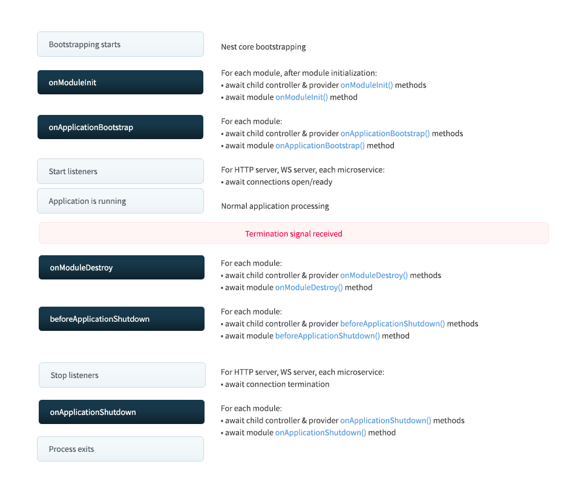

# Lifecycle Events

Nest 어플리케이션은 네스트에 의해 관리되는 라이프사이클이 있습니다.
Nest는 lifecycle(생명주기) 훅을 제공합니다.
이 훅들은 라이프 사이클 이벤트에 대한 가시성을 제공하고, 이러한 이벤트가 발생할 때 여러분이 등록된 코드를 실행할 수 있도록 도와줍니다.
이 훅은 모듈, 프로바이더 또는 컨트롤러에서 사용할 수 있습니다."

## Lifecycle sequence

아래의 다이어그램은 어플리케이션의 시작부터 종료될 때까지의 주요 라이프사이클 이벤트들을 보여줍니다.
우리는 전반적인 라이프사이클을 세 가지 단계로 나누어볼 수 있습니다: 초기화, 실행, 종료
라이프사이클 훅을 사용하여 모듈 및 서비스의 적절한 초기화를 계획하고, active connection을 관리하며, 애플리케이션이 종료 신호를 수신하면 gracefully하게 종료할 수 있습니다.



## Lifecycle events

라이프사이클 이벤트는 애플리케이션 부트스트래핑 및 종료 중에 발생합니다.
Nest는 각 라이프사이클 이벤트에서 모듈, 프로바이더 및 컨트롤러에 등록된 라이프사이클 훅 메서드를 호출합니다 
(종료 훅은 [아래](https://docs.nestjs.com/fundamentals/lifecycle-events#application-shutdown)에서 설명한대로 먼저 활성화해야 합니다).
위의 다이어그램에서 보듯이, Nest는 connection 수신을 시작하고 connection 수신을 중지하기 위해 해당하는 기본 메서드를 호출합니다.

아래의 표에있는, onModuleDestroy, beforeApplicationShutdown 그리고 onApplicationShutdown 메서드들은 명시적으로 여러분이 app.close()를 호출하거나, 프로세스가 시스템 신호 (SIGTERM)을 받고 여러분이 어플리케이션 부트스트랩 코드에 enableShutdownHooks()를 호출할 때 트리거 됩니다.

| Lifecycle hook method       | Likfecycle event triggering the hook method call                                                                                                         |
|-----------------------------|----------------------------------------------------------------------------------------------------------------------------------------------------------|
| onModuleInit()              | 모듈들의 의존성이 모두 해결되었을 때                                                                                                                                     |
| onApplicationBootstrap()    | 모든 모듈이 초기화되었을 때, 하지만 connection이 되기전                                                                                                                     |
| onModuleDestroy()           | 종료 시그널(e.g., SIGTERM)을 받은 이후                                                                                                                             |
| beforeApplicationShutdown() | onModuleDestroy()가 모두 완료된 후에 호출됨 <br/>(onModuleDestory() 메서드의 Promises가 resolve되거나 reject). 완료되면 (Promises가 해결되거나 거부된 후), 모든 연결이 닫히고 (app.close()가 호출됨). |
| onApplicationShutdown()     | 모든 연결이 닫히고 난 후 (app.close()가 resolve 되었을 때)                                                                                                              |


이러한 이벤트에 대해 명시적으로 app.close()를 호출하지 않으면 SIGTERM과 같은 시스템 신호와 함께 작동하도록 선택해야 합니다.
아래의 [Application shutdown](https://docs.nestjs.com/fundamentals/lifecycle-events#application-shutdown)를 보세요

> WARNING
> 
> 라이프사이클 훅은 request-scoped 클래스들에서는 발동되지 않습니다. Request-scoped 클래스들은 어플리케이션의 라이프사이클과 연결되어 있지 않습니다.
> 그리고 이 클래스들의 생명주기는 예측할 수 없습니다.
> 이 클래스들은 각 요청에 의해 독점적으로 생성되고 요청이 끝난 후 자동적으로 가비지 콜렉팅 됩니다.

> HINT
> 
> onModuleInit() 과 onApplicationBootstrap()의 실행 순서는 모듈의 imports에 직접적으로 의존적이며, 직전의 훅을 기다립니다.

## Usage

각 라이프사이클 훅은 인터페이스로 표현됩니다.
인터페이스는 타입스크립트로의 컴파일 이후에는 존재하지 않기 때문에 기술적으로는 optional 입니다.
그럼에도 불구하고 강력한 타이핑 및 에디터의 도움을 받으려먼 인터페이스는 좋은 선택입니다.
라이프사이클 훅을 등록하기 위해서는 적절한 인터피에스를 구현해야합니다.
예를 들어, 특정 클래스에서 (e.g. 컨트롤러, 프로바이더 또는 모듈) 모듈이 초기화되는 동안 호출할 메서드가 있다면, OnModuleInit 인터페이스의 onModuleInit() 메서드를 구현하면 됩니다.

```typescript
import { Injectable, OnModuleInit } from '@nestjs/common';

@Injectable()
export class UsersService implements OnModuleInit {
  onModuleInit() {
    console.log(`The module has been initialized.`);
  }
}
```

## Asynchronous initialization


OnModuleInit 및 OnApplicationBootstrap 훅은 애플리케이션 초기화 프로세스를 지연시킬 수 있도록 허용합니다. (Promise를 반환하거나 메서드를 async로 표시하고 메서드 본문에서 비동기 메서드 완료를 기다릴 수 있음)

```typescript
async onModuleInit(): Promise<void> {
  await this.fetch();
}
```

## Application shutdown

onModuleDestory(), beforeApplicationShutdown() 그리고 onApplicationShutdown() 훅들은 종료 단계에서 호출됩니다.
이 기능은 종종 Kubernetes와 함께 사용되어 컨테이너의 라이프사이클을 관리하거나, Heroku에서 다이노(dynos)나 유사한 서비스를 관리하는 데 사용됩니다.

셧다운 이벤트가 발생할 때 실행되는 리스너들은 시스템 자원을 소비합니다.
그래서 기본적으로 사용할 수 없음 처리되어 있습니다.
셧다운 훅들을 사용하기 위해서, enableShutdownHooks()를 호출해야합니다.

> WARNING
> 
> 기본 플랫폼 제한으로 인해 NestJS는 Windows에서 애플리케이션 종료 훅을 제한적으로 지원합니다.
> SIGINT가 작동할 것으로 예상할 수 있으며, SIGBREAK 및 일부 경우에는 SIGHUP도 작동할 것입니다 - 자세한 내용은 [여기](https://nodejs.org/api/process.html#process_signal_events)를 더 읽어보세요. 그러나 SIGTERM은 Windows에서 절대 작동하지 않을 것입니다. 왜냐하면 작업 관리자에서 프로세스를 종료하는 것이 조건 없기 때문에 "즉, 애플리케이션이 이를 감지하거나 방지할 방법이 없습니다". Windows에서 SIGINT, SIGBREAK 및 기타 신호가 어떻게 처리되는지에 대한 자세한 내용은 libuv의 [관련 문서](https://docs.libuv.org/en/v1.x/signal.html)를 참조하세요. 또한 Node.js의 [Process Signal Events](https://nodejs.org/api/process.html#process_signal_events) 문서도 확인하세요.

> INFO
> 
> enableShutdownHooks는 리스너를 시작함으로써 메모리를 소비합니다.
> Jest와 함께 병렬 테스트를 실행하는 등 하나의 Node 프로세스에서 여러 Nest 앱을 실행하는 경우에는 Node가 과도한 리스너 프로세스에 대한 경고를 표시할 수 있습니다.
> 이러한 이유로 enableShutdownHooks는 기본적으로 활성화되지 않습니다.
> 하나의 Node 프로세스에서 여러 인스턴스를 실행하는 경우에는 이 조건을 인식하고 주의하세요.


애플리케이션이 종료 신호를 수신하면 등록된 onModuleDestroy(), beforeApplicationShutdown(), 그리고 onApplicationShutdown() 메서드를 호출할 것이며 (위에서 설명한 순서대로) 해당 신호를 첫 번째 매개변수로 전달합니다. 등록된 함수가 비동기 호출을 기다리는 경우 (프로미스를 반환하는 경우), Nest는 프로미스가 resolve되거나 reject될 때까지 시퀀스를 진행하지 않습니다."

```typescript
@Injectable()
class UsersService implements OnApplicationShutdown {
  onApplicationShutdown(signal: string) {
    console.log(signal); // e.g. "SIGINT"
  }
}
```

> INFO
> 
> app.close()를 호출하는 것은 Node 프로세스를 종료되지 않고, onModuleDestory()가 발동되고 onApplicationShutdown() 훅이 발동됩니다.
> 따라서 이 과정에서 긴 실행 시간의 백그라운드 작업이 실행된다면 시간이 많이 소요됩니다.
> 프로세스는 자동으로 종료되지 않을 것입니다.
