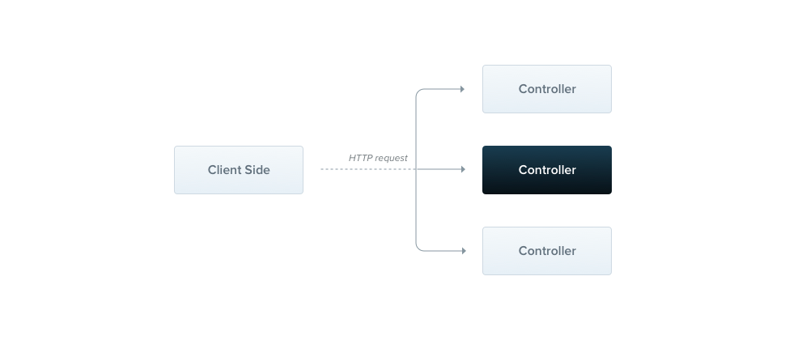

# Controllers

컨트롤러는 들어오는 요청을 처리하고 응답을 반환하는 역할을 합니다. 



기본 컨트롤러를 생성하기 위해 클래스와 데코레이터를 사용합니다.
데코레이터는 클래스를 필수 메타데이터와 연결하고 Nest가 라우팅 맵을 생성할 수 있도록 합니다(요청을 해당 컨트롤러에 연결).

## 라우팅

`@Controller()` 데코레이터에 라우팅 prefix를 설정해서 반복되는 코드를 줄일 수도 있습니다.

```typescript
import { Controller, Get } from '@nestjs/common';

@Controller('cats')
export class CatsController {
  @Get()
  findAll(): string {
    return 'This action returns all cats';
  }
}
```

> CLI를 사용하여 컨트롤러를 생성하려면 `$ nest g controller [name]` 명령을 실행하기만 하면 됩니다.

findAll() 메서드의 이름은 임의적입니다. 메서드의 이름은 라우팅과 아무런 관련이 없습니다.

위의 메서드는 200의 상태코드를 리턴합니다. 그리고 문자열을 리턴합니다.
왜 그럴까요? 이를 설명하기 위해서는 네스트가 리턴 값을 조절하여 응답을 조작하는 두 가지 옵션을 소개합니다.

| 기본 (추천하는 방식)   | 자바스크립트 객체 또는 배열을 반환하면 자동으로 JSON으로 직렬화(변환)하여 리턴합니다.<br/> 하지만 primitive type을 리턴하면 JSON으로 직렬화 되지 않고 그 값을 그대로 리턴합니다.<br/> 또한 상태코드는 POST 요청을 제외하고 기본적으로 항상 200 입니다. `@HttpCode(...)` 데코레이터를 사용하여 상태 코드를 변경할 수 있습니다. |
|----------------|---------------------------------------------------------------------------------------------------------------------------------------------------------------------------------------------------------------|
| 특정 라이브러리 위한 방법 | 라이브러리에 사용하는 응답 객체를 `@Res()` 데코레이터를 이용해 주입하고 사용할 수 있습니다 (Express와 같이). 이 방법으로는 res 객체를 native하게 그대로 사용할 수 있습니다. e.g `response.status(200).send()`                                                                  |

> 경고
> @Res()나 @Next() 를 핸들러(컨트롤러의 라우팅 메서드)가 직접 사용하는 경우, Nest는 이 핸들러가 Library-specific한 방법을 사용했음을 감지합니다.
> 따라서 표준 접근 방식이 자동으로 비활성화됩니다.
> 만약에 두 가지 방식을 동시에 사용하려면 passthrouth 옵션을 true로 설정해야 합니다. `@Res({passthrough: true})`

## 요청 객체

핸들러는 클라이언트의 요청 세부 정보에 접근해야 하는 경우가 많습니다.
Nest는 기본 플랫폼(Express가 default)의 요청 객체에 대한 접근 방법을 제공합니다.
`@Req()` 데코레이터를 핸들러의 매개 변수에 정의하면 요청 객체를 사용할 수 있습니다.

```typescript
import { Controller, Get, Req } from '@nestjs/common';
import { Request } from 'express';

@Controller('cats')
export class CatsController {
  @Get()
  findAll(@Req() request: Request): string {
    return 'This action returns all cats';
  }
}
```

> 힌트
> express의 응답 객체의 타입을 제공 받으려면 @types/express 패키지를 설치하세요. 

요청 객체는 Http 요청을 나타내며 쿼리 스트링, 헤더, 바디 등을 가지고 있습니다. (자세한 내용은 [여기](https://expressjs.com/en/api.html#req) 참조)
주로 사용하는 속성들은 기본적으로 제공되는 데코레이터를 사용하여 가지고 올 수 있습니다.

| @Request(), @Req()    | req                           |
|-----------------------|-------------------------------|
| @Response(), @Res()*  | 	res                          |
| @Next()               | 	next                         |
| @Session()	           | req.session                   |
| @Param(key?: string)  | 	req.params/req.params[key]   |
|@Body(key?: string)| 	req.body/req.body[key]       |
|@Query(key?: string)| 	req.query/req.query[key]     |
|@Headers(name?: string)	| req.headers/req.headers[name] |
|@Ip()	| req.ip                        |
|@HostParam()	| req.hosts                     |

앞서 설명했듯이 `@Res()`를 사용할 경우 반드시 `res.json(...)` 또는 `res.send(...)` 와 적절한 응답을 개발자가 내려주어야합니다.
그렇지 않으면 제대로 응답할 수 없습니다. (Http server will hang)

- @Get()
- @Post()
- @Put()
- @Delete()
- @Patch()
- @Options() - [MDN -OPTIONS](https://developer.mozilla.org/ko/docs/Web/HTTP/Methods/OPTIONS)
- @Head() - [MDN - HEAD](https://developer.mozilla.org/ko/docs/Web/HTTP/Methods/HEAD)
- @All()

## 와일드카드 라우팅

- 와일드카드는 정규식과 관련이 있으므로, 필요할 때 참조하여 설정

패턴 기반 라우팅을 지원, 예를 들어 '*'가 와일드카드로 사용되면 모든 문자 조합과 일치

```javascript
@Get('ab*cd')
findAll(){
  return 'This route uses a wildcard';
}
```
> path 문자열 중간에 있는 와일드카드는 익스프레스에서만 지원됩니다.

## 상태 코드

응답의 상태 코드는 기본적으로 항상 200 입니다.
POST 메서드는 기본적으로 201을 리턴합니다.
우리는 이 상태 코드를 @HttpCode(...) 데코레이터를 추가함으로써 핸들러 레벨에서 쉽게 변경할 수 있습니다.

```typescript
@Post()
@HttpCode(204)
create() {
  return 'This action adds a new cat';
}
```

하지만 상태 코드가 항상 고정적이지 않을 수 있습니다. 이럴 때는 `@Res()` 데코레이터를 사용하여 응답 객체를 직접 사용할 수 있습니다.

## 헤더

응답에 header를 정의하라면 `@Header()` 데코레이터를 사용할 수 있습니다. (`res.header()`를 직접 호출할 수도 있습니다.)

```typescript
@Post()
@Header('Cache-Control', 'none')
create() {
  return 'This action adds a new cat';
}
```

## 리다이렉션

특정 URL롤 리다이렉트 하기 위해서 `@Redirect()` 데코레이터를 사용하거나 res 객체를 사용할 수 있습니다. (`res.redirect()`)

`@Redirect()` 데코레이터는 url과 statusCode를 매개변수로 받습니다.
두 개의 매개변수 모두 옵셔널입니다.
상태코드를 생략할 경우 디폴트 statusCode는 302 (Found) 입니다.

```typescript
@Get()
@Redirect('https://nestjs.com', 301)
```
> HINT
> 때로는 HTTP 상태코드와 리다이렉트 URL을 동적으로 결정해야할 수도 있습니다. 이 때는 `HttpRedirectResponse` 인터페이스를 구현하는 객체를 리턴하세요

```typescript
import { HttpStatus } from '../../enums';
export interface HttpRedirectResponse {
    url: string;
    statusCode: HttpStatus;
}

```

```typescript
// http://localhost:3000/docs 요청 시 기본적으로 @Redirect()에 정의된 설정대로 리다이렉션
// 그러나 http://localhost:3000/docs?version=5 으로 요청 시 return 에 정의된 url로 리다이렉션
@Get('docs')
@Redirect('https://docs.nestjs.com', 302)
getDocs(@Query('version') version) {
  if (version && version === '5') {
    return { url: 'https://docs.nestjs.com/v5/' };
  }
}
```

## 라우팅 파라미터

요청 URL에서 동적으로 파라미터를 파싱해야 하는 경우 사용할 수 있습니다.

```typescript
// any는 나중에 pipe를 이용하여 변환 가능

@Get(':id')
findOne(@Param() params: any): string {
  console.log(params.id);
  return `This action returns a #${params.id} cat`;
}

@Get(':id')
findOne(@Param('id') id: string): string {
  return `This action returns a #${id} cat`;
}

```

## 서브 도메인 라우팅

@Controller 데코레이터는 요청의 HTTP 호스트가 특정 값과 일치하도록 요구하는 옵션을 사용할 수 있습니다.

```typescript
@Controller({ host: 'admin.example.com' })
export class AdminController {
  @Get()
  index(): string {
    return 'Admin page';
  }
}
```

- localhost에서 요청 시 아래의 컨트롤러의 핸들러는 404로 라우터를 찾지 못함
```typescript
@Controller({ host: 'localhost111' })
@Controller()
export class AppController {
  constructor(private readonly appService: AppService) {}

  @Get()
  getHello(@HostParam() host, @Req() req): string {
    console.log(req.hostname); // localhost
    console.log(host); // {}
    return this.appService.getHello();
  }
}
```

경로와 유사하게 path옵션 hosts은 토큰을 사용하여 호스트 이름의 해당 위치에서 동적 값을 캡처할 수 있습니다.
아래 데코레이터 예제 의 호스트 매개변수 토큰은 `@Controller()`이러한 사용법을 보여줍니다.
이러한 방식으로 선언된 호스트 매개변수는 `@HostParam()` 메소드 시그니처에 추가되어야 하는 데코레이터를 사용하여 액세스할 수 있습니다.

## Scopes (범위)

다양한 프로그래밍 언어 배경을 가진 사람들의 경우 Nest에서 들어오는 요청 전반에 걸쳐 거의 모든 것이 공유된다는 사실이 예상치 못한 일일 수도 있습니다.

데이터베이스에 대한 연결 풀, 전역 상태를 갖는 싱글톤 서비스 등이 있습니다.

**Node.js는 모든 요청이 별도의 스레드에 의해 처리되는 요청/응답 다중 스레드 상태 비저장 모델을 따르지 않는다는 점을 기억하세요.**

따라서 싱글톤 인스턴스를 사용하는 것은 우리 애플리케이션에 완전히 안전 합니다.

## 비동기성

우리는 모던 자바스크립트를 좋아하고 거의 모든 데이터 추출 작업이 비동기적이라는 것을 알고 있습니다.

그렇기 때문에 Nest는 async 함수를 잘 지원합니다.

모든 async 함수는 Promise를 리턴해야 합니다. (그리고 리턴합니다)

이는 Nest가 자체적으로 지연된 값(deffered value)을 반환할 수 있음을 의미합니다.

```typescript
@Get()
async findAll(): Promise<any[]> {
  return [];
}
```

위의 코드는 완전히 유효합니다.

더 나아가, Nest 라우트 핸들러는 RxJS observable 스트림을 반환할 수 있는 더 강력한 기능을 가지고 있습니다.

Nest는 자동으로 소스에 구독하고 스트림이 완료될 때 마지막으로 발생한 값을 가져옵니다.

```typescript
@Get()
findAll(): Observable<any[]> {
  return of([]);
}
```

## 요청 페이로드

이전에 작성한 POST 라우트 핸들러의 예제는 클라이언트 파라미터를 받지 않았습니다. 여기에 @Body() 데코레이터를 추가하여 이를 수정해 보겠습니다.

그러나 먼저 (TypeScript를 사용한다면) DTO (Data Transfer Object) 스키마를 결정해야 합니다.

TypeScript 인터페이스를 사용하거나 간단한 클래스를 사용하여 DTO 스키마를 결정할 수 있습니다.

흥미로운 점은 여기서 클래스를 사용하는 것을 권장한다는 것입니다.

왜냐하면 클래스는 JavaScript ES6 표준의 일부이며, 따라서 컴파일된 JavaScript에서 실제 엔터티로 보존됩니다. 

반면 TypeScript 인터페이스는 트랜스파일 중에 제거되기 때문에 Nest는 런타임에서 이를 참조할 수 없습니다.

이는 Pipes와 같은 기능이 런타임에서 변수의 메타타입에 액세스할 수 있을 때 추가적인 가능성을 제공하기 때문에 중요합니다.

> DTO는 클래스로 정의하길 권장 why? 인터페이스로도 정의될 수 있으나 자바스크립트로 트랜스파일 되면 사라지므로 Nest가 참조할 수 없습니다.
> 이는 Pipe와 같은 기능이 런타임에 변수의 메타타입에 접근할 수 있는 가능성을 제공하므로 중요합니다.

```typescript
export class CreateCatDto {
  name: string;
  age: number;
  breed: string;
}
```

```typescript
@Post()
async create(@Body() createCatDto: CreateCatDto) {
  return 'This action adds a new cat';
}
```

>HINT
> ValidationPipe메소드 핸들러가 수신해서는 안 되는 속성을 필터링할 수 있습니다.
> 이 경우 허용되는 속성을 화이트리스트에 추가할 수 있으며, 화이트리스트에 포함되지 않은 속성은 결과 개체에서 자동으로 제거됩니다.
> CreateCatDto 에서 화이트리스트는 name, age 및 breed 속성 입니다.
> 여기에서 자세히 알아보세요 https://docs.nestjs.com/techniques/validation#stripping-properties.

## Library specific approach

지금까지는 응답을 조작하는 Nest 표준 방식에 대해 논의했습니다.
응답을 조작하는 두 번째 방법은 응댑 객체를 사용하는 것입니다.

```typescript
import { Controller, Get, Post, Res, HttpStatus } from '@nestjs/common';
import { Response } from 'express';

@Controller('cats')
export class CatsController {
  @Post()
  create(@Res() res: Response) {
    res.status(HttpStatus.CREATED).send();
  }

  @Get()
  findAll(@Res() res: Response) {
     res.status(HttpStatus.OK).json([]);
  }
}
```
이 접근 방식은 작동하지만 실제로 응답 객체에 대한 완전한 제어를 제공하여 일부 측면에서 더 유연성을 가지게 합니다 (헤더 조작, 라이브러리별 기능 등).

그러나 이를 사용할 때 주의가 필요합니다.

일반적으로 이 접근 방식은 훨씬 명확하지 않으며 일부 단점이 있습니다.

주요 단점은 코드가 플랫폼에 종속되어 있어(기본 라이브러리마다 응답 객체에 대한 API가 다를 수 있음) 테스트하기 어려워진다는 것입니다 (응답 객체를 모의로 대체해야 함 등).

또한 위의 예제에서는 Nest 표준 응답 처리에 따라 동작하는 Interceptors 및 @HttpCode() / @Header() 데코레이터와 같은 Nest 기능과의 호환성을 잃게 됩니다.

이를 해결하기 위해 다음과 같이 passthrough 옵션을 true로 설정할 수 있습니다:

```typescript
@Get()
findAll(@Res({ passthrough: true }) res: Response) {
  res.status(HttpStatus.OK);
  return [];
}
```

이제 기본 응답 개체와 상호 작용할 수 있지만(예: 특정 조건에 따라 쿠키 또는 헤더 설정) 나머지는 프레임워크에 맡깁니다.
